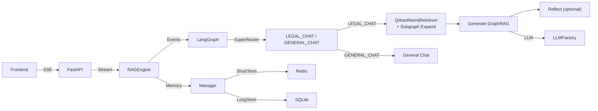
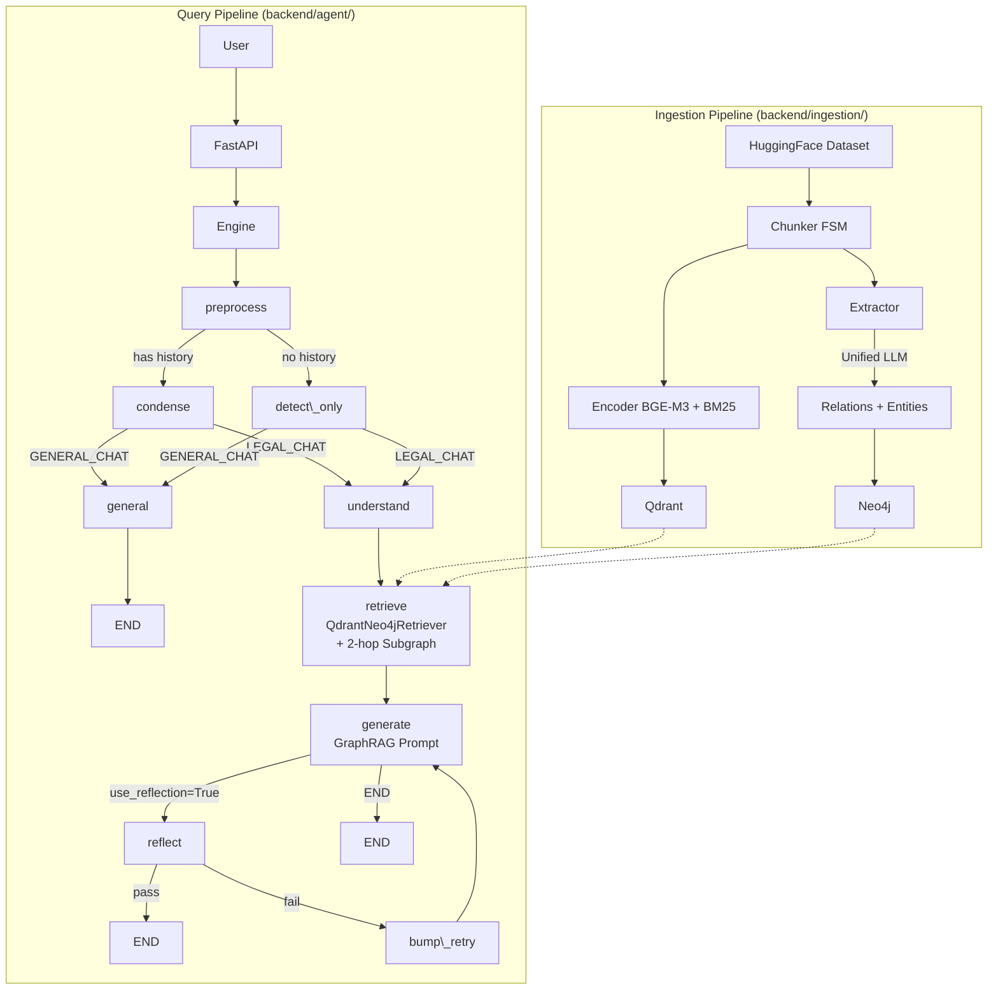

# ⚖️ Legal-RAG: Trợ lý Pháp luật Việt Nam Thông minh

Hệ thống **Advanced Agentic RAG** mã nguồn mở chuyên biệt cho văn bản pháp luật Việt Nam. Ứng dụng công nghệ Hybrid Search (Dense + Sparse), Kiến trúc Đa tác vụ (Multi-agent) và cơ chế Tự phản hồi (Reflection) để đảm bảo độ chính xác pháp lý tối đa.

---

## 🌟 Tính năng Nổi bật

- **🧠 Universal 5-Stage Agentic Pipeline**: Hệ thống được điều phối đồng nhất qua LangGraph qua các bước: `Understand` → `Retrieve` → `Resolve References` → `Grade` → `Generate` → `Reflect`.
- **🛡️ CRAG & Self-RAG (Anti-Hallucination)**: Đánh giá độ tin cậy của tài liệu truy xuất (Grade) với cơ chế Retry/Rewrite. Tự động kiểm tra chéo trích dẫn và tính xác thực (Fact Check) trước khi trả câu trả lời cho người dùng.
- **🔍 HyDE & Hybrid Search**: Sinh "câu trả lời giả định" (HyDE) kết hợp với tìm kiếm lai (Dense `BGE-M3` + Sparse) và Cross-Encoder Rerank để xử lý các thuật ngữ pháp lý phức tạp.
- **🕸️ Graph RAG (Neo4j)**: Sử dụng Knowledge Graph để mở rộng ngữ cảnh (Bottom-Up & Lateral Expansion), giúp AI hiểu mối quan hệ phân cấp giữa các văn bản pháp luật.
- **⚖️ Chain-of-Thought (CoT) Legal Reasoning**: Ép buộc LLM tuân thủ logic suy luận pháp lý chuẩn xác (Lex Superior, Lex Posterior).
- **🧩 Unified GraphRAG Architecture (Single Strategy)**: Mọi query pháp lý đều đi qua `LegalChatStrategy` duy nhất: QdrantNeo4jRetriever (vector search + Neo4j auto-fetch) → 2-hop subgraph expansion → GraphRAG Prompt.
- **💬 2 Chế độ Hoạt động**:
    1. **Legal Chat** (`LEGAL_CHAT`): Giải đáp tất cả câu hỏi pháp lý (tra cứu, tổng hợp, đối chiếu, phân tích) thông qua GraphRAG pipeline.
    2. **General Chat** (`GENERAL_CHAT`): Trả lời thông thường, bỏ qua toàn bộ RAG pipeline.
- **💾 Smart Memory & Tiered LLM**: Quản lý hội thoại đa tầng (Redis + SQLite). Tự động phân luồng Model phù hợp (Ollama/Internal cho định tuyến, Gemini/Llama cho suy luận).
- **🧩 Unified LLM Extraction (Single-Pass)**: Trích xuất quan hệ văn bản, thực thể tự do và quan hệ node đồ thị trong một lần gọi LLM duy nhất, loại bỏ các bước quét thừa.

---

## 🏗️ Kiến trúc Hệ thống & Luồng Dữ liệu

Dưới đây là sơ đồ luồng dữ liệu tổng thể từ lúc người dùng đặt câu hỏi đến khi nhận được phản hồi đã qua kiểm duyệt:



### Luồng Xử lý RAG Tổng quát (End-to-End Pipeline)


---

## 📂 Cấu trúc Repository

```text
Legal-RAG/
├── backend/
│   ├── agent/                             # LÕI HỆ THỐNG: LangGraph Agent Framework
│   │   ├── state.py                       #   Data Schema (AgentState)
│   │   ├── memory.py                      #   Bộ nhớ hội thoại (Redis + SQLite)
│   │   ├── query_router.py                #   SuperRouter: phân loại 2 mode + HyDE + Filters
│   │   ├── graph.py                       #   LangGraph Topology & 10 Nodes
│   │   ├── chat_engine.py                 #   Vòng lặp streaming SSE cho Frontend
│   │   ├── legal_chat.py                  #   LegalChatStrategy duy nhất (Unified GraphRAG)
│   │   ├── utils_legal.py                 #   fetch_related_graph, format_graph_context, build_legal_context
│   │   └── utils_general.py               #   execute_general_chat, SubTimer
│   ├── api/                               # FastAPI endpoints & Session Management
│   │   ├── main.py                        #   Khởi tạo app, CORS, lifespan
│   │   └── routes/                        #   Route handlers
│   ├── database/                          # Clients kết nối CSDL
│   │   ├── qdrant_client.py               #   Qdrant connection & collection setup
│   │   └── neo4j_client.py                #   Neo4j Graph Build, Constraints & Entity Enrichment
│   ├── ingestion/                         # PIPELINE NẠP DỮ LIỆU (Offline)
│   │   ├── chunking_embedding.py          #   🚀 SCRIPT CHẠY CHÍNH: 6-Phase Pipeline
│   │   ├── pipeline.py                    #   Orchestration helpers
│   │   ├── chunker/                       #   FSM Chunking Engine
│   │   │   ├── core.py                    #     Orchestrator: AdvancedLegalChunker
│   │   │   ├── fsm.py                     #     Finite State Machine duyệt dòng
│   │   │   ├── metadata.py                #     Regex Patterns & doc_key normalization
│   │   │   ├── heuristics.py              #     Relation hint detection
│   │   │   ├── payload.py                 #     Đóng gói Qdrant/Neo4j payload
│   │   │   └── toc.py                     #     Table-of-Contents extraction
│   │   └── extractor/                     #   Trích xuất quan hệ & thực thể
│   │       ├── relations.py               #     Ontology Relation Extraction (10 nhãn)
│   │       └── entities.py                #     Unified LLM Entity Extraction
│   ├── models/                            # Model AI (Embedding, LLM, Reranker)
│   │   ├── embedder.py                    #   BGE-M3 Dense + fastembed BM25 Sparse
│   │   ├── reranker.py                    #   Cross-Encoder Reranker (REST API)
│   │   ├── llm_client.py                  #   Multi-provider LLM Client
│   │   ├── llm_factory.py                 #   Factory Pattern cho LLM providers
│   │   └── interfaces.py                  #   Abstract interfaces
│   ├── retrieval/                         # Runtime Search Engine
│   │   ├── hybrid_search.py               #   Tiered Prefetch + Rerank + Context Expansion
│   │   └── graph_search.py                #   Neo4j Graph Traversal queries
│   ├── utils/                             # Tiện ích chung
│   │   ├── document_parser.py             #   Parser file upload (DOC, PDF)
│   │   └── text_utils.py                  #   Chuỗi, JSON extraction helpers
│   └── prompt.py                          # Tổng hợp System Prompts
├── frontend/                              # Giao diện Next.js 15 Web App (TailwindCSS)
├── docs/                                  # Tài liệu kỹ thuật chi tiết
│   ├── agent_architecture.md              #   Kiến trúc Agent Framework
│   ├── chunking_embedding_report.md       #   Báo cáo kỹ thuật Ingestion Pipeline
│   └── neo4j_query.md                     #   Tham khảo Cypher queries
├── tests/                                 # Bộ kiểm thử tự động
├── .debug/                                # (Auto-generated) Log debug từ Extractor
├── .checkpoints/                          # (Auto-generated) Checkpoint resume cho Ingestion
├── .reports/                              # (Auto-generated) Báo cáo pipeline
├── quick_start.ps1                        # Script khởi động 1-click (Windows)
├── quick_start.sh                         # Script khởi động 1-click (Linux/Mac)
└── docker-compose.yml                     # Triển khai Redis, Qdrant & Neo4j Containers
```

---

## 🚀 Hướng dẫn Cài đặt từ đầu (Zero to Hero)

### 1. Yêu cầu Hệ thống
- **Docker Desktop**: Chạy Redis và Qdrant, Neo4J
- **Python 3.10+**: Cho Backend.
- **Node.js 18+**: Cho Frontend.
- **Dung lượng ổ đĩa**: Khoảng 5-10GB (để chứa Model Embedding bge-m3 và Vector DB).

### 2. Các bước triển khai

**Bước 1: Clone Repository**
```bash
git clone https://git.icomm.vn/nam.nguyen3/Legal-RAG.git
cd Legal-RAG
```

**Bước 2: Cấu hình Môi trường (.env)**
Copy file mẫu và điền thông tin API Key (ưu tiên Gemini để có hiệu suất tốt nhất):
```bash
cp .env.example .env
```
*Lưu ý: Đảm bảo các đường dẫn CACHE (`HF_HOME`, `SENTENCE_TRANSFORMERS_HOME`) trong `.env` trỏ về ổ đĩa có dung lượng trống.*

**Bước 3: Khởi động Database (Docker)**
Mở Docker Desktop, sau đó chạy:
```bash
docker-compose up -d
```

**Bước 4: Nạp Dữ liệu (Ingestion Pipeline)**
Chạy pipeline nạp dữ liệu từ HuggingFace Dataset vào Qdrant + Neo4j:
```bash
python backend/ingestion/chunking_embedding.py
```
Pipeline sẽ tự động thực hiện 6 pha:
1. **Phase 1-3**: Chunking văn bản gốc + văn bản tham chiếu (depth=2)
2. **Phase 4**: Tạo Ghost Nodes cho VB được nhắc đến nhưng không có trong dataset
3. **Phase 5**: Embedding (BGE-M3 + BM25) & Upsert Qdrant
4. **Phase 6**: Build Neo4j Graph (Document Tree + Entity Enrichment)

**Bước 5: Khởi động toàn bộ Hệ thống**
Sử dụng script tự động (tốt nhất trên Windows):
```powershell
.\quick_start.ps1
```
Script sẽ tự động:
- Dọn dẹp các cổng 3000, 8000, 8001.
- Kích hoạt Python Venv và cài thư viện.
- Mở 3 cửa sổ riêng biệt cho: **Embedding Server**, **FastAPI Backend**, và **Next.js Frontend**.

---

## 💻 Truy cập Ứng dụng

- **Giao diện người dùng**: `http://localhost:3000` (Giao diện Next.js Premium Dark Theme).
- **Backend API Docs**: `http://localhost:8000/docs`.
- **Qdrant Dashboard**: `http://localhost:6335/dashboard`.

---

## ⚙️ Cấu hình (Environment Variables)

| Biến | Mô tả |
| :--- | :--- |
| `LLM_PROVIDER` | `internal` \| `gemini` \| `ollama` |
| `QDRANT_URL` | Địa chỉ Qdrant (mặc định localhost:6335) |
| `NEO4J_URI` | Địa chỉ Neo4j (mặc định bolt://localhost:7687) |
| `REDIS_URL` | Địa chỉ Redis cho memory |
| `LEGAL_DENSE_MODEL`| Model embedding (mặc định `BAAI/bge-m3`) |

---

## 🛠️ Công nghệ Sử dụng

- **Models**: BGE-M3 (Embedding), Llama-3 (LLM), Gemini (Pro).
- **Backend**: FastAPI, Redis, LangGraph.
- **Frontend**: Next.js 15, TailwindCSS (Premium UI).
- **Vector DB**: Qdrant.
- **Graph DB**: Neo4j.
- **ORM/Storage**: SQLite (History), Redis (Cache).
