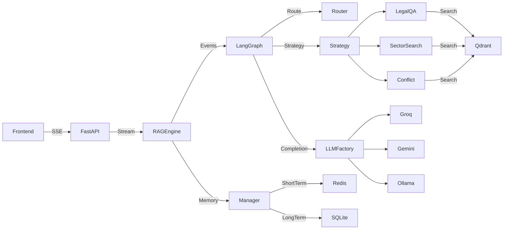
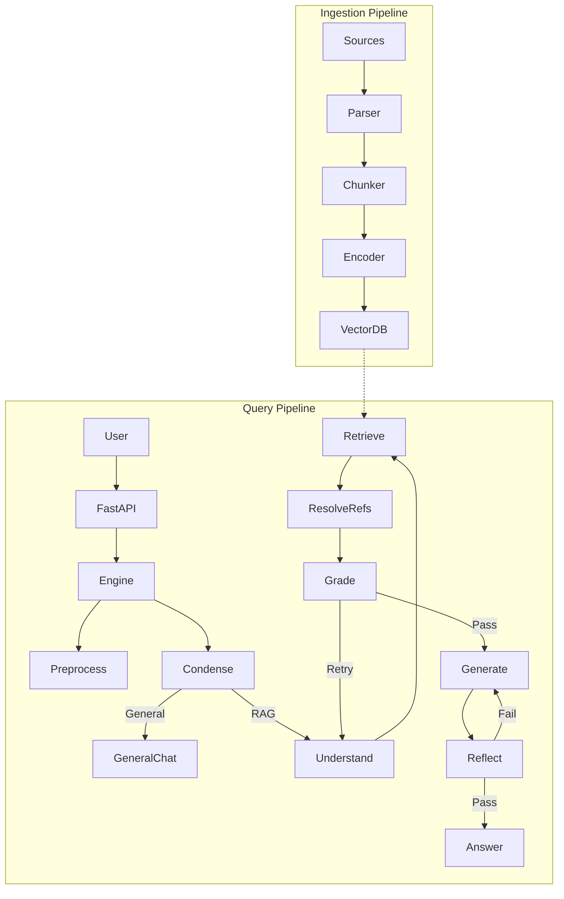

# ⚖️ Legal-RAG: Trợ lý Pháp luật Việt Nam Thông minh

Hệ thống **Advanced Agentic RAG** mã nguồn mở chuyên biệt cho văn bản pháp luật Việt Nam. Ứng dụng công nghệ Hybrid Search (Dense + Sparse), Kiến trúc Đa tác vụ (Multi-agent) và cơ chế Tự phản hồi (Reflection) để đảm bảo độ chính xác pháp lý tối đa.

---

## 🌟 Tính năng Nổi bật

- **🧠 Universal 5-Stage Agentic Pipeline**: Hệ thống được điều phối đồng nhất qua LangGraph qua các bước: `Understand` → `Retrieve` → `Resolve References` → `Grade` → `Generate` → `Reflect`.
- **🛡️ CRAG & Self-RAG (Anti-Hallucination)**: Đánh giá độ tin cậy của tài liệu truy xuất (Grade) với cơ chế Retry/Rewrite. Tự động kiểm tra chéo trích dẫn và tính xác thực (Fact Check) trước khi trả câu trả lời cho người dùng.
- **🔍 HyDE & Hybrid Search**: Sinh "câu trả lời giả định" (HyDE) kết hợp với tìm kiếm lai (Dense `BGE-M3` + Sparse) và Cross-Encoder Rerank để xử lý các thuật ngữ pháp lý phức tạp.
- **⚖️ Chain-of-Thought (CoT) Legal Reasoning**: Ép buộc LLM tuân thủ logic suy luận pháp lý chuẩn xác (Lex Superior, Lex Posterior) thông qua các the `<thinking>` ẩn bảo vệ quy tắc đóng-domain.
- **📋 4 Chế độ Hoạt động Chuyên biệt (Strategy Pattern)**:
    1. **Legal QA**: Giải đáp tình huống.
    2. **Sector Search**: Tổng hợp, liệt kê văn bản.
    3. **Conflict Analyzer**: Đối soát pháp lý tự động cho file nội quy/hợp đồng (Batch processing).
    4. **General Chat**: Trò chuyện tự do.
- **💾 Smart Memory & Tiered LLM**: Quản lý hội thoại đa tầng (Redis + SQLite). Tự động phân luồng Model rẻ cho định tuyến/đánh giá (`llama-3.1-8b`) và Model nặng cho suy luận (`llama-3.3-70b`).

---

## 🏗️ Kiến trúc Hệ thống & Luồng Dữ liệu

Dưới đây là sơ đồ luồng dữ liệu tổng thể từ lúc người dùng đặt câu hỏi đến khi nhận được phản hồi đã qua kiểm duyệt:



### Luồng Xử lý RAG Tổng quát (End-to-End Pipeline)


---

## 📂 Cấu trúc Repository

```text
Legal-RAG/
├── backend/
│   ├── agent/                             # LÕI HỆ THỐNG: LangGraph, 4 Chiến lược (QA, Sector, Conflict, General)
│   ├── api/                               # FastAPI endpoints & Session Management
│   ├── llm/                               # Multi-Provider LLM Factory (Groq, Gemini, Ollama)
│   ├── retrieval/                         # BGE-M3 Embedder, Hybrid Search, Qdrant Client, Ingestion
│   ├── utils/                             # Document parser (PDF/DOCX)
│   └── data/                              # SQLite persistent storage
├── frontend/                              # Giao diện Next.js Web App
├── scripts/                               # Công cụ nạp dữ liệu (Ingest) & Crawl
├── qdrant_snapshots/                      # Nơi chứa file backup CSDL (.snapshot)
├── qdrant_storage/                        # Dữ liệu Vector DB thực tế (Docker mount)
├── quick_start.ps1                        # Script khởi động 1-click (Windows)
└── docker-compose.yml                     # Triển khai Redis & Qdrant Containers
```

---

## 🚀 Hướng dẫn Cài đặt từ đầu (Zero to Hero)

### 1. Yêu cầu Hệ thống
- **Docker Desktop**: Chạy Redis và Qdrant.
- **Python 3.10+**: Cho Backend.
- **Node.js 18+**: Cho Frontend.
- **Dung lượng ổ đĩa**: Khoảng 5-10GB (để chứa Model Embedding bge-m3 và Vector DB).

### 2. Các bước triển khai

**Bước 1: Clone Repository**
```bash
git clone https://github.com/ngnam1104/Legal-RAG.git
cd Legal-RAG
```

**Bước 2: Cấu hình Môi trường (.env)**
Copy file mẫu và điền thông tin API Key (ưu tiên Gemini để có hiệu suất tốt nhất):
```bash
cp .env.example .env
```
*Lưu ý: Đảm bảo các đường dẫn CACHE (`HF_HOME`, `SENTENCE_TRANSFORMERS_HOME`) trong `.env` trỏ về ổ đĩa có dung lượng trống.*

**Bước 3: Khởi động Database (Docker)**
Mở Docker Desktop, sau đó chạy:
```bash
docker-compose up -d
```

**Bước 4: Khôi phục Dữ liệu (Qdrant Snapshot)**
Nếu bạn có file snapshot (.snapshot) của CSDL Luật Việt Nam:
1. Copy file snapshot vào thư mục `./qdrant_snapshots/`.
2. Truy cập Dashboard Qdrant tại: `http://localhost:6335/dashboard`.
3. Chọn **Collections** -> Tạo collection mới (nếu chưa có) -> **Snapshots** -> **Restore from snapshot**.
4. (Hoặc dùng script nạp dữ liệu từ đầu):
   ```bash
   # Tạo venv và cài dependencies trước khi chạy script
   python -m venv venv
   .\venv\Scripts\Activate.ps1
   pip install -r requirements.txt
   python scripts/ingest_local.py
   ```

**Bước 5: Khởi động toàn bộ Hệ thống**
Sử dụng script tự động (tốt nhất trên Windows):
```powershell
.\quick_start.ps1
```
Script sẽ tự động:
- Dọn dẹp các cổng 3000, 8000, 8001.
- Kích hoạt Python Venv và cài thư viện.
- Mở 3 cửa sổ riêng biệt cho: **Embedding Server**, **FastAPI Backend**, và **Next.js Frontend**.

---

## 💻 Truy cập Ứng dụng

- **Giao diện người dùng**: `http://localhost:3000` (Giao diện Next.js Premium Dark Theme).
- **Backend API Docs**: `http://localhost:8000/docs`.
- **Qdrant Dashboard**: `http://localhost:6335/dashboard`.

---

## ⚙️ Cấu hình (Environment Variables)

| Biến | Mô tả |
| :--- | :--- |
| `LLM_PROVIDER` | `groq` \| `gemini` \| `ollama` |
| `QDRANT_URL` | Địa chỉ Qdrant (mặc định localhost:6335) |
| `REDIS_URL` | Địa chỉ Redis cho memory |
| `LEGAL_DENSE_MODEL`| Model embedding (mặc định `BAAI/bge-m3`) |

---

## 🛠️ Công nghệ Sử dụng

- **Models**: BGE-M3 (Embedding), Llama-3 (LLM), Gemini (Fallback).
- **Backend**: FastAPI, Redis, LangGraph.
- **Frontend**: Next.js 15, TailwindCSS (Premium UI).
- **Vector DB**: Qdrant.
- **ORM/Storage**: SQLite (History), Redis (Cache).
