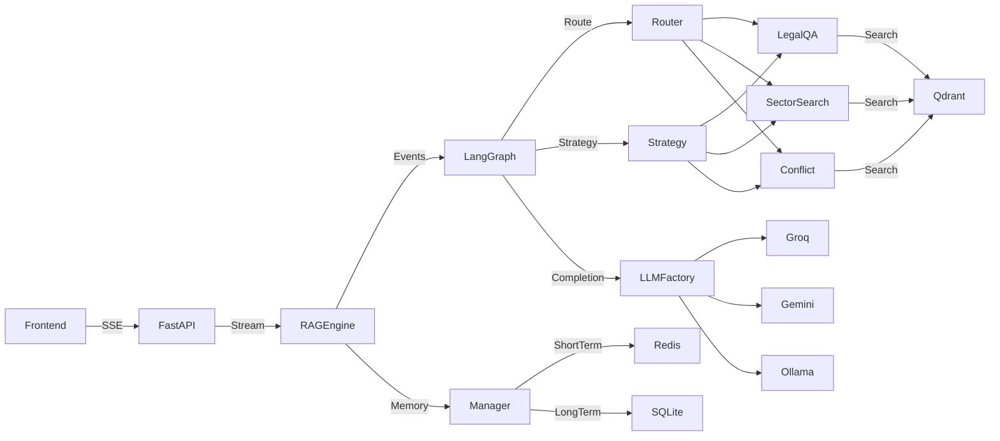
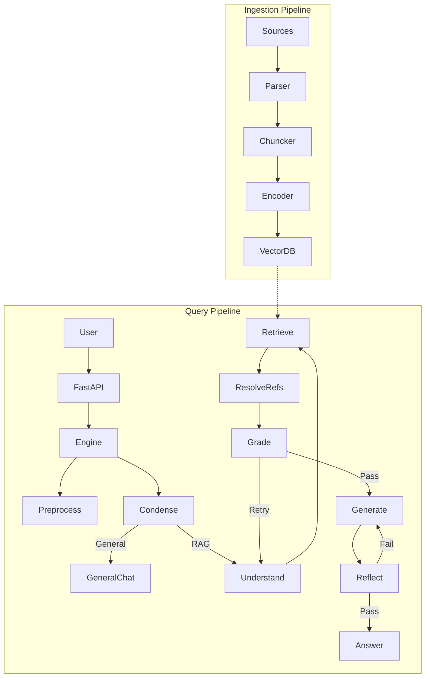

# 🏛️ Tổng Quan Kiến Trúc Legal-RAG (Cập nhật)

Tài liệu này trích xuất các thành phần cốt lõi của kiến trúc hệ thống Legal-RAG thực tế.

---

## 1. Tổng Quan Kiến Trúc

Hệ thống Legal-RAG được tổ chức theo mô hình **Agentic RAG thế hệ 3**, kết hợp:
- **CRAG (Corrective RAG)**: Retrieval Evaluator (Node `Grade`) đánh giá độ tin cậy context. Nếu kém → retry search với query viết lại.
- **Self-RAG (Self-Reflective RAG)**: Node `Reflect` tự sinh reflection tokens kiểm tra hallucination/citation/relevance.
- **HyDE (Hypothetical Document Embeddings)**: Node `Understand` yêu cầu LLM sinh "câu trả lời giả định" → embed → vector search.
- **Chain-of-Thought (CoT) cho Legal Reasoning**: Node `Generate` (Conflict Analyzer) ép LLM suy luận Lex Superior → Lex Posterior → Deontic Rules.
- **Universal 5-Stage Pipeline**: Mọi luồng chạy qua cùng một đồ thị LangGraph (Understand → Retrieve → Resolve References → Grade → Generate → Reflect).
- **Strategy Pattern**: Logic nghiệp vụ delegate cho Strategy class, đồ thị không đổi.
- **Routing Model Strategy**: Phân tầng LLM — model nhẹ (`llama-3.1-8b-instant`) cho routing/grading, model nặng (`llama-3.3-70b-versatile`) cho reasoning.
- **Kiến Trúc Đồng Bộ (Synchronous Pipeline)**: Loại bỏ hoàn toàn Celery background workers để đơn giản hóa hạ tầng. Các tác vụ như Ingestion (Chunking & Embedding) giờ đây được chạy đồng bộ qua FastAPI Background Tasks hoặc in-memory, giảm footprint hệ thống.

### 1.1 Sơ đồ Thành phần Cấp cao



### 1.2 Cấu trúc Thư mục Toàn Dự Án

```
Legal-RAG/
├── backend/
│   ├── __init__.py
│   ├── config.py                          # Pydantic Settings (LLM, Qdrant, Redis)
│   ├── agent/                             # === LÕI HỆ THỐNG ===
│   │   ├── state.py                       # AgentState TypedDict (Universal 5-Stage)
│   │   ├── graph.py                       # LangGraph StateGraph + Node wiring
│   │   ├── chat_engine.py                 # RAGEngine wrapper (streaming + memory)
│   │   ├── query_router.py                # Auto Intent Detection (Few-Shot LLM)
│   │   ├── strategies/                    # === STRATEGY PATTERN ===
│   │   │   ├── base.py                    # BaseRAGStrategy (ABC, 6 abstract methods)
│   │   │   ├── legal_qa.py                # LegalQAStrategy (CRAG + HyDE + Reflection)
│   │   │   ├── sector_search.py           # SectorSearchStrategy (MapReduce + Coverage)
│   │   │   └── conflict_analyzer.py       # ConflictAnalyzerStrategy (CoT Judge)
│   │   ├── utils_legal_qa.py              # Prompts + helper functions cho Legal QA
│   │   ├── utils_sector_search.py         # Prompts + helper functions cho Sector Search
│   │   ├── utils_conflict_analyzer.py     # Prompts + helper functions cho Conflict Analyzer
│   │   └── utils_general_chat.py          # Prompt + execute_general_chat()
│   ├── llm/                               # === MULTI-PROVIDER LLM FACTORY ===
│   │   ├── base.py                        # BaseLLMClient (ABC)
│   │   ├── factory.py                     # chat_completion() — Unified entry point
│   │   ├── groq_client.py                 # OpenAI-compatible (Groq) + Retry logic
│   │   ├── gemini_client.py               # Google GenAI SDK
│   │   └── ollama_client.py               # Local Ollama
│   ├── retrieval/                         # === VECTOR DB, EMBEDDING & INGESTION ===
│   │   ├── hybrid_search.py               # HybridRetriever: Dense + Sparse + RRF + Rerank
│   │   ├── embedder.py                    # BGE-M3 Dense + Sparse Encoder (PyTorch)
│   │   ├── reranker.py                    # Cross-Encoder ms-marco-MiniLM-L-6-v2
│   │   ├── chunker.py                     # AdvancedLegalChunker (Hierarchical)
│   │   ├── ingestion.py                   # process_document_task (Synchronous)
│   │   ├── remote_embedder.py             # Remote Embedding Server client
│   │   ├── server.py                      # Embedding Server (FastAPI)
│   │   ├── vector_db.py                   # Qdrant Client instance
│   │   └── base.py                        # BaseRetriever / BaseEmbedder (ABC)
│   ├── api/
│   │   └── main.py                        # FastAPI app (Chat SSE, Sessions, Upload, Ingest, Sync)
│   ├── utils/
│   │   └── document_parser.py             # PDF/DOCX parser
│   └── data/
│       └── chat_history.db                # SQLite persistent storage
110: ├── frontend/                              # === NEXT.JS 15 UI ===
111: │   └── src/
112: │       ├── app/                           # App Router (layout.tsx, page.tsx)
113: │       ├── components/
114: │       │   ├── chat/
115: │       │   │   ├── ChatArea.tsx            # Main chat area (markdown, steps, references)
116: │       │   │   ├── ChatContainer.tsx       # Container + layout
117: │       │   │   ├── ChatInput.tsx           # Input box + file upload + mode selector
118: │       │   │   ├── LegalReference.tsx      # Collapsible legal reference cards
119: │       │   │   └── ModeSelector.tsx        # LEGAL_QA / SECTOR_SEARCH / CONFLICT_ANALYZER toggle
120: │       │   └── layout/                    # Sidebar, Header, Navigation
121: │       └── contexts/
122: │           └── ChatContext.tsx             # Global state management (SSE consumer)
123: ├── scripts/
124: │   ├── core/
│   │   └── ingest_local.py                # HuggingFace → Chunker → Embedder → Qdrant bulk ingest
│   ├── crawl_legal_docs.py                # HF + Qdrant → Generate .txt/.docx/.pdf test files
│   ├── test_presets.py                    # LLM preset integration tests
│   └── tests/                             # Unit test directory
└── .env                                   # Environment variables
```

---

## 2. Sơ Đồ Kiến Trúc RAG Tổng Quát (End-to-End Pipeline)

Sơ đồ dưới đây mô tả **toàn bộ luồng dữ liệu** từ khi văn bản pháp luật được thu thập cho đến khi người dùng nhận được câu trả lời đã kiểm duyệt.

### 2.1 Macro Pipeline: Từ Document Source → User Answer



### 2.2 Data Flow Overview Table

| Giai đoạn | Input | Xử lý | Output | Model/Tool |
|:---|:---|:---|:---|:---|
| **Document Source** | HuggingFace Dataset / User Upload | Download / Upload | Raw files (.pdf, .docx, .txt) | `crawl_legal_docs.py` |
| **Parsing** | Raw file | Extract text + metadata | Plaintext + metadata dict | `document_parser.py` |
| **Chunking** | Plaintext | Hierarchical split (Chương→Điều→Khoản) + Appendix/Footer trap | Chunk objects with breadcrumb payload | `chunker.py` (Custom) |
| **Embedding** | Chunk text | Single forward pass BGE-M3 | Dense vector (1024d) + Sparse vector (Lexical Weights) | `BAAI/bge-m3` (PyTorch) |
| **Vector Store** | Vectors + Payload | Upsert with 12 indexed fields | Qdrant collection | Qdrant (`6335:6333`) |
| **Query Rewrite (HyDE)** | User query | LLM generates hypothetical answer | Rewritten query + metadata filters | `llama-3.1-8b-instant` |
| **Retrieval** | HyDE query | 4-stream Tiered Prefetch → RRF Fusion | 40 candidates | `hybrid_search.py` |
| **Reranking** | 40 candidates + query | Cross-Encoder scoring (Optional Toggle) | Top 8-15 reranked | `BAAI/bge-reranker-v2-m3` |
| **Context Expansion** | Top hits | Small-to-Big (article_id scroll) + Window Retrieval (appendix) | Expanded context text | `hybrid_search.py` |
| **Grading (CRAG)** | Truncated context + query | LLM-as-Judge relevance check | is_sufficient boolean | `llama-3.1-8b-instant` |
| **Generation** | Full XML context + query | Closed-Domain CoT answer | Draft response with citations | `llama-3.3-70b` / `Gemini 1.5 Flash` |
| **Reflection (Self-RAG)** | Draft + context + query | Hallucination/Citation/Relevance check | Final response (pass/corrected) | `llama-3.1-8b-instant` |
