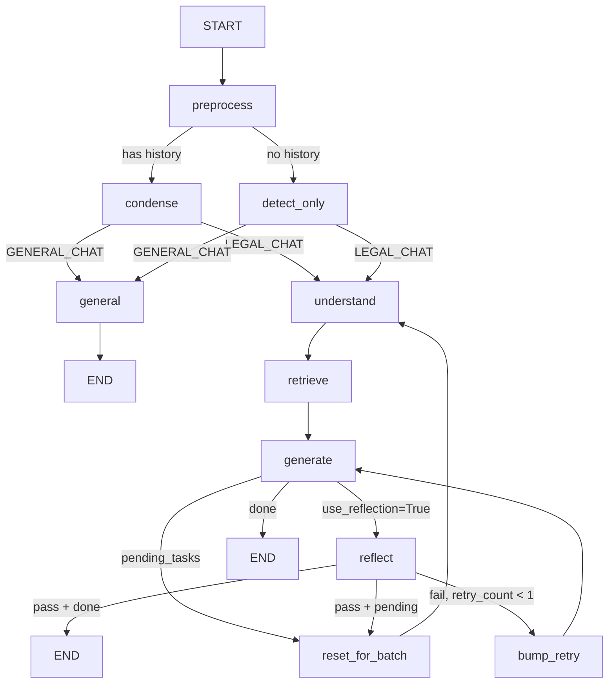
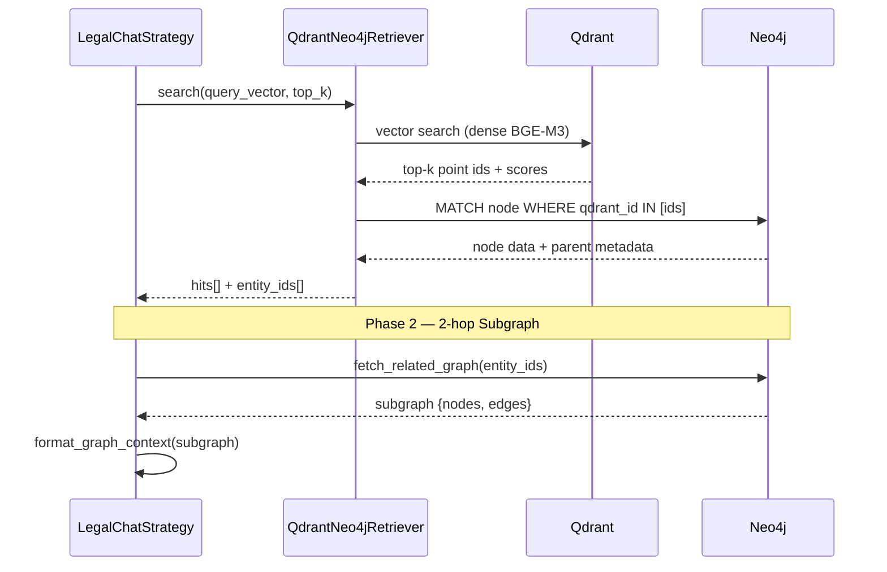

# 🧠 Kiến Trúc Agent Framework (Legal-RAG)

**Đường dẫn:** `backend/agent/`
**Cập nhật lần cuối:** 2026-04-29

Thư mục `backend/agent/` đóng vai trò là "bộ não" của hệ thống Legal-RAG. Hệ thống này được xây dựng trên **LangGraph**, áp dụng kiến trúc **Unified GraphRAG** với **một chiến lược duy nhất** (`LegalChatStrategy`) xử lý tất cả câu hỏi pháp lý, và **chỉ 2 mode phân loại**: `LEGAL_CHAT` và `GENERAL_CHAT`.

---

## 1. Cấu trúc Thư Mục Cốt Lõi

```text
backend/agent/
├── state.py                 # Định nghĩa Data Schema (AgentState)
├── memory.py                # Quản lý bộ nhớ hội thoại / ChatSessionManager
├── query_router.py          # SuperRouter: phân loại 2 mode + HyDE + Metadata Filter
├── graph.py                 # LangGraph Topology — 10 Nodes, 3 Conditional Routers
├── chat_engine.py           # Vòng lặp chính, xử lý streaming SSE cho Frontend
├── legal_chat.py            # LegalChatStrategy duy nhất (Unified GraphRAG)
├── utils_legal.py           # fetch_related_graph, format_graph_context, build_legal_context
└── utils_general.py         # execute_general_chat, SubTimer
```

> [!IMPORTANT]
> Kiến trúc hiện tại đã hợp nhất toàn bộ 3 mode cũ (LegalQA, SectorSearch, ConflictAnalyzer) thành **`LegalChatStrategy` duy nhất**. Router cũng đã giảm từ 4 intent xuống còn **2 mode**: `LEGAL_CHAT` và `GENERAL_CHAT`.

---

## 2. Topology LangGraph — Các Node & Edge

### 2.1 Sơ đồ luồng thực tế



### 2.2 Danh sách Node

| Node | Mục đích |
|---|---|
| `preprocess` | Load file upload từ cache hoặc disk trước khi xử lý |
| `condense` | Gọi SuperRouter khi **có** history: viết lại query + phân loại intent |
| `detect_only` | Gọi SuperRouter khi **không** có history (lần hỏi đầu tiên) |
| `general` | Trả lời thông thường — bypass toàn bộ RAG pipeline |
| `understand` | Chuẩn bị hypothetical query + metadata filters từ SuperRouter output |
| `retrieve` | QdrantNeo4jRetriever → 2-hop subgraph expansion |
| `generate` | GraphRAG Prompt (Nodes + Edges + Vector Context → LLM) |
| `reflect` | Reviewer agent: kiểm tra hallucination (optional, `use_reflection=True`) |
| `bump_retry` | Tăng `retry_count`, nới lỏng filters trước khi retry `generate` |
| `reset_for_batch` | Reset `retry_count` + `is_sufficient` khi bắt đầu batch mới |

### 2.3 Các Router (Conditional Edge)

| Router | Đầu vào | Các nhánh |
|---|---|---|
| `router_preprocess` | `history` có hay không | `condense` / `detect_only` |
| `router_dispatcher` | `detected_mode` | `general` / `understand` |
| `router_after_generate` | `use_reflection`, `pending_tasks` | `reflect` / `loop_next_batch` / `end` |
| `router_after_reflect` | `pass_flag`, `retry_count`, `pending_tasks` | `end` / `retry_generate` / `loop_next_batch` |

---

## 3. Giải Phẫu Chi Tiết Từng Thành Phần

### 3.1 State Management (`state.py`)

Toàn bộ quá trình chạy của Agent chia sẻ một trạng thái chung có kiểu `AgentState` (dựa trên `TypedDict`):

- **Inputs:** `query`, `session_id`, `mode`, `file_path`, `use_reflection`, `llm_preset`...
- **Truy vết Router:** `history`, `standalone_query`, `condensed_query` (HyDE query), `detected_mode`, `router_filters`.
- **RAG States:**
  - `rewritten_queries` / `metadata_filters` (Stage: Understand)
  - `raw_hits` / `graph_context` (Stage: Retrieve)
  - `final_response` / `references` (Stage: Generate)
  - `pass_flag` / `feedback` (Stage: Reflect)
- **Batching:** `pending_tasks` (hàng đợi), `completed_results` (kết quả tích lũy)
- **Stateful conversation:** `conversation_state` (`current_document`, `entities`)

### 3.2 SuperRouter — Chỉ 2 Mode (`query_router.py`)

`QueryRouter.super_route_query()` xử lý **3 việc trong 1 lần gọi LLM duy nhất**:
1. **Phân loại Intent** — chỉ trả về `LEGAL_CHAT` hoặc `GENERAL_CHAT`.
2. **Viết lại câu hỏi (HyDE)** — sinh `standalone_query` (khử đại từ) và `hypothetical_query` (câu trả lời giả định cho vector search).
3. **Trích xuất Metadata Filters** — `legal_type`, `doc_number`, `article_ref`...

> [!NOTE]
> **Heuristic Fast Path**: Câu hỏi ngắn (chào hỏi, cảm ơn...) được nhận diện ngay bằng blocklist từ khóa, bypass hoàn toàn LLM call → `GENERAL_CHAT` tức thì, không tốn thời gian.

```python
class RouteIntent(str):
    LEGAL_CHAT   = "LEGAL_CHAT"    # Tất cả câu hỏi pháp lý
    GENERAL_CHAT = "GENERAL_CHAT"  # Hỏi thăm, ngoài chủ đề
```

### 3.3 Quản Lý LangGraph (`graph.py`)

File này khởi tạo class `LegalRAGWorkflow` và compile đồ thị. Tất cả 10 node và 4 conditional router được đăng ký trong `_add_nodes()` / `_add_edges()`. Instance global `app` được export để `chat_engine.py` sử dụng.

**Factory pattern đơn giản hóa:**
```python
def get_strategy(mode: str) -> BaseRAGStrategy:
    """Tất cả mọi mode pháp lý đều sử dụng LegalChatStrategy."""
    return LegalChatStrategy()
```

### 3.4 Chiến Lược Duy Nhất — GraphRAG (`legal_chat.py`)

`LegalChatStrategy` kế thừa `BaseRAGStrategy` và cài đặt 4 phương thức:

#### Understand
- Lấy `condensed_query` (HyDE) và `router_filters` từ SuperRouter output.
- Nếu có file upload: tự động detect `doc_number` và enrichment query với tọa độ Điều/Khoản.

#### Retrieve (2-Phase)
**Phase 1 — QdrantNeo4jRetriever** (thư viện `neo4j-graphrag`):
```
query → encode_query_dense() → QdrantNeo4jRetriever.search()
    → Qdrant vector search (top_k hits)
    → Auto-fetch Neo4j node data (MATCH node WHERE qdrant_id = $id)
    → OPTIONAL MATCH BELONGS_TO/PART_OF (lấy parent metadata)
```

**Phase 2 — 2-hop Subgraph Expansion:**
```
entity_ids → fetch_related_graph() → subgraph (nodes[], edges[])
    → format_graph_context() → graph_ctx {nodes, edges}
```

**Fallback**: Nếu `QdrantNeo4jRetriever` thất bại → `_fallback_vector_search()` dùng `HybridRetriever` cũ (Dense+Sparse+Rerank).

#### Generate
- Nếu có `graph_ctx.nodes` → dùng `GRAPHRAG_PROMPT` (Nodes + Edges + Vector Context).
- Nếu không có graph data → fallback sang `ANSWER_PROMPT` (traditional context).
- Sau khi sinh câu trả lời: `filter_cited_references()` chỉ giữ lại references thực sự được trích dẫn.

#### Reflect (Optional)
- Chỉ chạy khi `use_reflection=True` trong state.
- Gọi `REFLECT_PROMPT` → LLM trả về JSON `{pass, issues, corrected_answer}`.
- Nếu `pass=False` và `retry_count < 1` → trigger `bump_retry` → `generate` lại với filters được nới lỏng.

### 3.5 Lõi Streaming (`chat_engine.py`)

Lớp `RAGEngine` quản lý I/O luồng người dùng qua SSE (Server-Sent Events):
- Lấy `session_id`, khởi tạo `initial_state`.
- Chạy LangGraph qua `astream_events(initial_state, version="v2")`.
- Map tên node thành thông báo tiến trình UI: `"retrieve"` → *"📚 Đang tìm kiếm..."*
- Sau khi kết thúc: cập nhật `conversation_state` (lưu `current_document`, `entities`) → ghi history vào SQLite.

---

## 4. Bản Đồ Debug (Troubleshooting Map)

| Hiện tượng lỗi | File cần xem |
|---|---|
| AI nhận diện sai mode (LEGAL vs GENERAL). | `backend/agent/query_router.py` → xem `ROUTER_PROMPT` và blocklist `greetings`. |
| AI không biết tên văn bản ở turn trước ("nó", "điều khoản đó"). | `backend/agent/chat_engine.py` → phần update `conv_state` sau mỗi turn. |
| Sai metadata filter (legal_type, doc_number rỗng). | `backend/agent/query_router.py` → xem phần `filters` trong JSON output. |
| Citation bị thiếu/sai (trả lời đúng nhưng không có nguồn). | `backend/agent/utils_legal.py` → `filter_cited_references()`. |
| `QdrantNeo4jRetriever` lỗi, fallback sang vector-only. | `backend/agent/legal_chat.py` → `_qdrant_neo4j_search()` và `_fallback_vector_search()`. |
| Subgraph expansion trả về rỗng (0 nodes, 0 edges). | `backend/agent/utils_legal.py` → `fetch_related_graph()` — kiểm tra Neo4j connection và `entity_ids`. |
| LangGraph vòng lặp vô tận (bump_retry loop). | `backend/agent/graph.py` → `router_after_reflect()` — điều kiện `retry_count < 1`. |
| Stream API (Frontend) không trả text. | `backend/agent/chat_engine.py` → `astream_events` catch `on_chain_end`. |
| File upload không được phân tích đúng. | `backend/agent/graph.py` → `node_preprocess()` và `backend/utils/document_parser.py`. |

---

## 5. Chi Tiết Luồng Retrieve — QdrantNeo4jRetriever + Subgraph



**Cypher query auto-fetch của `QdrantNeo4jRetriever`:**
```cypher
MATCH (node)
WHERE node.qdrant_id = $id OR node.id = $id
OPTIONAL MATCH (node)-[:BELONGS_TO|PART_OF*1..2]->(parent)
RETURN node {
    .*,
    parent_title: parent.title,
    parent_doc_number: parent.document_number,
    parent_url: parent.url
} AS metadata
```

---

## 6. Pipeline Ingestion (Offline — `backend/ingestion/`)

Phần nạp dữ liệu vào Qdrant + Neo4j chạy tách rời khỏi Agent, được điều phối bởi `backend/ingestion/chunking_embedding.py`.

### 6.1 Cấu trúc Module Ingestion

```text
backend/ingestion/
├── chunking_embedding.py        # 🚀 Script chạy chính — 6-Phase Pipeline
├── pipeline.py                  # Orchestration helpers
├── chunker/                     # FSM Chunking Engine (modular)
│   ├── core.py                  #   AdvancedLegalChunker (orchestrator)
│   ├── fsm.py                   #   Finite State Machine duyệt dòng
│   ├── metadata.py              #   Regex Patterns & normalize_doc_key
│   ├── heuristics.py            #   Phát hiện hint quan hệ (relation_hints)
│   ├── payload.py               #   Đóng gói payload Qdrant & Neo4j
│   └── toc.py                   #   Trích xuất Table-of-Contents
└── extractor/                   # Trích xuất quan hệ & thực thể
    ├── relations.py             #   Ontology Relation Extraction (10 nhãn + Passive Chain)
    └── entities.py              #   Unified LLM prompt: entities + node_relations
```

### 6.2 6-Phase Pipeline

| Phase | Mục đích |
|---|---|
| **Phase 1** | Chunking 8000 văn bản gốc (từ CSV Y tế) |
| **Phase 2** | Chunking văn bản tham chiếu (discovered depth=1) |
| **Phase 3** | Chunking tham chiếu depth=2 |
| **Phase 4** | Tạo Ghost Nodes (VB được tham chiếu nhưng không có trong dataset) |
| **Phase 5** | Embedding BGE-M3 Dense + fastembed BM25 Sparse → Upsert Qdrant |
| **Phase 6** | Build Neo4j: Document Tree + Ghost Nodes + Graph Triplets + Entity Enrichment |

### 6.3 Unified LLM Extraction (Single-Pass)

Một batch đoạn văn → 1 prompt → 1 response LLM chứa đồng thời:
- `doc_relations`: 10 nhãn ontology (BASED_ON, AMENDS, REPLACES, REPEALS, GUIDES, APPLIES, ISSUED_WITH, ASSIGNS, CORRECTS, REFERENCES)
- `entities`: Thực thể tự do động (Organization, Person, Fee, Condition...)
- `node_relations`: Graph Triplets giữa các thực thể

### 6.4 Debug & Checkpoint

| Thư mục | Nội dung |
|---|---|
| `.debug/` | Log debug từ Extractor (auto-generated, ngoài root) |
| `.checkpoints/` | Checkpoint pickle từng VB — cho phép resume khi bị crash |
| `.reports/` | Báo cáo thống kê + benchmark sau mỗi lần chạy pipeline |

> [!TIP]
> **Điểm Nhấn Kiến Trúc (Architecture Highlight):**
> Nhờ `get_strategy()` trả về `LegalChatStrategy()` cho mọi mode pháp lý, toàn bộ logic retrieve và generate nằm ở một chỗ duy nhất. Nếu muốn thêm hành vi đặc biệt (ví dụ xử lý batch conflict claims), chỉ cần mở rộng `LegalChatStrategy` hoặc thêm node mới vào LangGraph mà không cần tạo strategy riêng.
