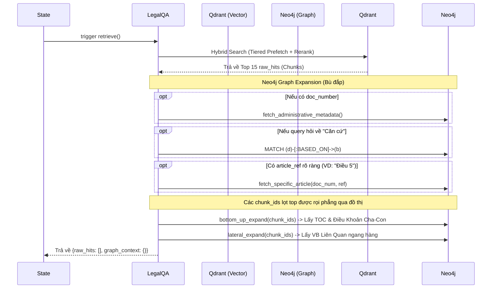
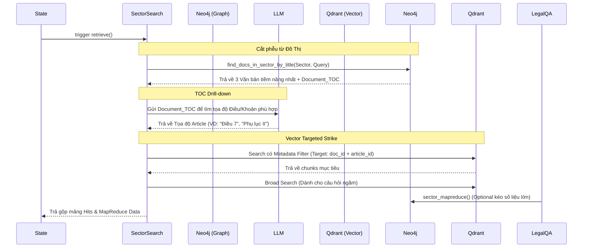
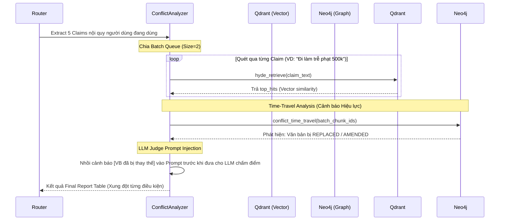

# 🧠 Kiến Trúc Agent Framework (Legal-RAG)

**Đường dẫn:** `backend/agent/`
**Cập nhật lần cuối:** 2026-04-22

Thư mục `backend/agent/` đóng vai trò là "bộ não" của hệ thống Legal-RAG. Hệ thống này được xây dựng trên **LangGraph**, áp dụng kiến trúc **Stateful Multi-turn Routing** kết hợp với mẫu thiết kế **Strategy Pattern** để linh hoạt xử lý nhiều loại câu hỏi pháp lý phức tạp khác nhau.

Dưới đây là sơ đồ luồng dữ liệu (Data Flow) và giải phẫu chi tiết từng thành phần, nhằm mục đích giúp bạn dễ dàng nắm bắt và debug.

---

## 1. Cấu trúc Thư Mục Cốt Lõi

```text
backend/agent/
├── state.py                 # Định nghĩa Data Schema (AgentState)
├── memory.py                # Quản lý bộ nhớ hội thoại / ChatSessionManager
├── query_router.py          # LLM SuperRouter (Classify intent, Rewrite, Extract)
├── graph.py                 # Khởi tạo và thiết lập Topology của LangGraph
├── chat_engine.py           # Vòng lặp chính, xử lý streaming cho Frontend
├── strategies/              # Cài đặt cụ thể cho từng Intent (Strategy Pattern)
│   ├── base.py              # Interface BaseRAGStrategy
│   ├── legal_qa.py          # Chiến lược trả lời câu hỏi trực tiếp
│   ├── sector_search.py     # Chiến lược tìm kiếm danh sách/thống kê
│   └── conflict_analyzer.py # Chiến lược phân tích mâu thuẫn/hiệu lực
└── utils/                   # Các hàm prompt/helper chuyên biệt cho từng chiến lược
```

---

## 2. Giải Phẫu Chi Tiết Từng Thành Phần

### 2.1 State Management (`state.py`)

Toàn bộ quá trình chạy của Agent chia sẻ một trạng thái chung có kiểu `AgentState` (dựa trên `TypedDict`). State này mô hình hóa luồng RAG 5 bước thực tế (hiện tại chạy 3 bước cốt lõi thay vì 5 để tối ưu):

- **Inputs:** `query`, `session_id`, `mode`, `llm_preset`...
- **Truy vết:** `history`, `standalone_query`, `condensed_query` (HyDE query), `detected_mode`, `router_filters`.
- **RAG States:**
  - `rewritten_queries` / `metadata_filters` (Stage 1: Understand)
  - `raw_hits` / `graph_context` (Stage 2: Retrieve)
  - `draft_response` / `final_response` / `references` (Stage 4: Generate)
- **Stateful lưu trữ:** `conversation_state` (Tình trạng lưu vết ngữ cảnh như `current_document` và `entities`).

### 2.2 SuperRouter (`query_router.py`)

Thay vì dùng nhiều prompt riêng lẻ vừa tốn thời gian vừa rời rạc, hệ thống gộp vào một class `QueryRouter` "Super Prompt" xử lý **3 việc trong 1 lần gọi LLM duy nhất**:
1. **Phân loại Intent:** Trả về một trong `LEGAL_QA`, `SECTOR_SEARCH`, `CONFLICT_ANALYZER`, `GENERAL_CHAT`.
2. **Viết lại câu hỏi (Contextualization & HyDE):** Thay thế đại từ (dựa trên lịch sử/context) thành `standalone_query`, và đồng thời bổ sung giả định kết quả thành `condensed_query` để dùng cho Vector Search.
3. **Trích xuất Metadata Filters:** Trích xuất `legal_type`, `doc_number`, `article_ref`... thành JSON dict chuẩn hóa.

### 2.3 Quản Lý LangGraph (`graph.py`)

Chứa topology cốt lõi của LangGraph. Gồm các node:
1. `preprocess`: Đọc cache hoặc parse file upload (trước lúc tính toán RAG).
2. `condense`: Gọi `SuperRouter` để có được query rewrite và intent. Bị điều kiện lọc bỏ (nhảy sang `detect_only`) nếu không có History. 
3. **Dispatcher (Conditional Edge):** Nhánh sang `general` (bỏ qua RAG) hoặc nhánh sang `understand` (tiến vào RAG).
4. `understand` → `retrieve` → `generate`: Bộ 3 Node RAG Pipeline.
   - Nhờ **mẫu thiết kế Delegate**, các node này dùng chung mã nhưng sẽ linh động gọi logic tùy vào `detected_mode`:
     ```python
     strategy = get_strategy(state["detected_mode"])
     result = strategy.understand(state) # Hoặc retrieve, generate
     ```

### 2.4 Chiến Lược Theo Tình Huống (`strategies/`)

Mẫu thiết kế (Design Pattern) sử dụng là **Strategy**. Lớp trừu tượng `BaseRAGStrategy` yêu cầu các lớp con cài đặt 3 node `understand`, `retrieve`, `generate`.

- **`LegalQAStrategy` (`legal_qa.py`):**
  - **Retrieve:** Trỏ filter Qdrant truyền thống + Mở rộng Neo4j (tìm căn cứ `BASED_ON`, lấy text của Điều/Khoản trực tiếp, mở rộng ngang dọc Bottom-Up/Lateral).
  - **Generate:** Dùng `standalone_query` để sinh câu trả lời bằng prompt `ANSWER_PROMPT`, map references có thật dùng trong text trả lời.
  
- **`SectorSearchStrategy` (`sector_search.py`):** Dành cho các câu hỏi mang tính chất báo cáo, liệt kê ban hành, lọc số lượng, phân loại. Ưu tiên các bảng biểu trong generate.
- **`ConflictAnalyzerStrategy` (`conflict_analyzer.py`):** Phổ biến cho câu hỏi tìm sửa đổi, bổ sung, hết hiệu lực, hoặc người dùng muốn đối chiếu một tình huống.

### 2.5 Lõi Streaming (`chat_engine.py`)

Lớp `RAGEngine` chuyên quản lý I/O luồng người dùng để đẩy ra FastAPI/Frontend bằng SSE (Server-Sent Events).
- Lấy `session_id`, khởi tạo `initial_state`.
- Chạy LangGraph ngầm qua `astream_events(initial_state, version="v2")`.
- Map tên node thành tiến trình UI ví dụ: `node_messages["retrieve"]` = *"📚 Đang tìm kiếm cơ sở dữ liệu pháp luật..."*.
- Khi kết thúc, lấy `answer` ra từ `final_state`, cập nhật trạng thái Context Entity (`conversation_state`) để chuẩn bị cho turn sau, và lưu trữ vào SQL.

---

## 3. Bản Đồ Di Chuyển Khi Debug (Troubleshooting Map)

Để dễ dàng fix bug, hãy tra cứu theo quy tắc sau:

| Hiện tượng lỗi | Nơi kiểm tra / File cần xem |
|---|---|
| AI nhận diện sai câu hỏi (Vào sai chế độ, ví dụ hỏi thủ tục lại trả về bảng biểu so sánh). | Kiểm tra `backend/agent/query_router.py`, xem xét `super_system_prompt`. |
| AI báo lỗi parse đại từ "nó", "điều khoản này" nhưng không biết tên văn bản ở luồng trước. | Kiểm tra `backend/agent/chat_engine.py` (phần lưu `conv_state`) hoặc phần prompt lưu tiểu sử trong `query_router.py`. |
| Rút trích sai tên cơ quan hoặc số quyết định, sai metadata `filters = {}` | Kiểm tra **Rules** giải thích trong `backend/agent/query_router.py`. |
| Legal QA trả lời đúng nhưng bị sai Citation (Không trích nguồn). | Kiểm tra `backend/agent/utils/utils_legal_qa.py` (`filter_cited_references`). Nơi này chặn nếu LLM ko in đậm tham chiếu. |
| Graph Expansion gọi Neo4j bị lỗi nhưng search Vector vẫn chạy. | Kiểm tra khối `try...except` ở mục `retrieve` trong `backend/agent/strategies/legal_qa.py` (hoặc strategy tương đương). |
| LangGraph bị loop vô tận hoặc bị crash state Schema. | Kiểm tra `AgentState` (`state.py`) và Edge/Node Dispatcher tại `graph.py`. |
| Stream API (Frontend) không trả text, đứng im. | Kiểm tra `astream_events` trong `backend/agent/chat_engine.py` có catch được event `on_chain_end` hay không. |

---

## 4. Chi Tiết Cơ Chế Khai Thác Song Song 2 CSDL (Qdrant & Neo4j)

Điểm phức tạp nhưng mạnh mẽ nhất của kiến trúc là khả năng **Graph-Vector Orchestration** (phối hợp Đồ thị và Vector) khác nhau tùy theo Intent. Cơ chế này được định nghĩa tại hàm `retrieve(self, state)` của từng class trong `strategies/`.

### 4.1 Luồng LEGAL_QA (Vector đi trước, Graph bù đắp)

Chiến lược này dùng cho các câu hỏi tra cứu nội dung thông thường cơ bản. Do nội dung nằm rải rác, hệ thống dùng **Qdrant làm chủ đạo** để tìm kiếm nội dung, rồi dùng **Neo4j rọi sáng bối cảnh**.



**Tóm lược:** Qdrant tìm các điểm chạm nhỏ nhất (point matches). Neo4j xây lại cấu trúc hoàn chỉnh (Document TOC, Sibling Texts) và tạo quan hệ ngang (liên kết văn bản bổ sung).

### 4.2 Luồng SECTOR_SEARCH (Graph đi trước, TOC Drill-down kéo Vector)

Chiến lược này xử lý câu hỏi gom nhóm diện rộng "Xin danh sách luật về Y_Tế". Vector DB sẽ bị "mù" khi search diện rộng, do đó **Neo4j đi trước** để chốt danh sách văn bản, sau đó điều khiển Qdrant qua LLM.



**Tóm lược:** Hạn chế nhược điểm search Vector bằng cách dùng Đồ thị đếm/lấy danh sách chuẩn, và dùng mục lục (TOC) làm bản đồ khoanh vùng cho Vector bắn độ chính xác tuyệt đối.

### 4.3 Luồng CONFLICT_ANALYZER (Vector bóc tách mệnh đề, Graph cảnh báo Hiệu lực gốc - Time Travel)

Đối phó với các mệnh đề "chồng chéo" hay kiểm duyệt văn bản người dùng tải lên, chế độ này chặt nhỏ câu hỏi/tài liệu thành nhiều Claims. Phối hợp tinh vi DB để báo trước rủi ro luật chết.



**Tóm lược:** Lôi hết các điều luật đối chiếu ra bằng vector, sau đó quăng toàn bộ list ID vào graph Neo4j hỏi "*Trong đám này có anh nào bị khai tử, chỉnh sửa chưa?*". Nếu có, báo lại cho LLM Judge biết trước khi đưa ra phán quyết.


> [!TIP]
> **Điểm Nhấn Kiến Trúc (Architecture Highlight):**
> Nhờ mẫu thiết kế Strategy (OOP), nếu tương lai bạn quyết định tạo một chế độ Chatbot hoàn toàn mới (Ví dụ: `DRAFT_CREATOR_MODE` chuyên hỗ trợ viết mới văn bản), bạn chỉ cần:
> 1. Thêm `DRAFT_CREATOR` vào lớp `RouteIntent` ở `query_router.py`.
> 2. Kế thừa `BaseRAGStrategy` thành `draft_creator.py` trong `strategies/`.
> 3. Khai báo nó trong factory function ở `graph.py`. Toàn bộ Graph Pipeline hiện có không hề bị suy suyển (Open/Closed Principle)!
