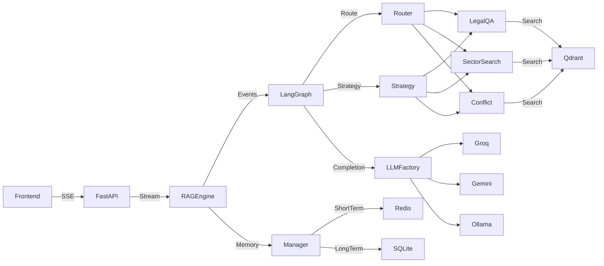
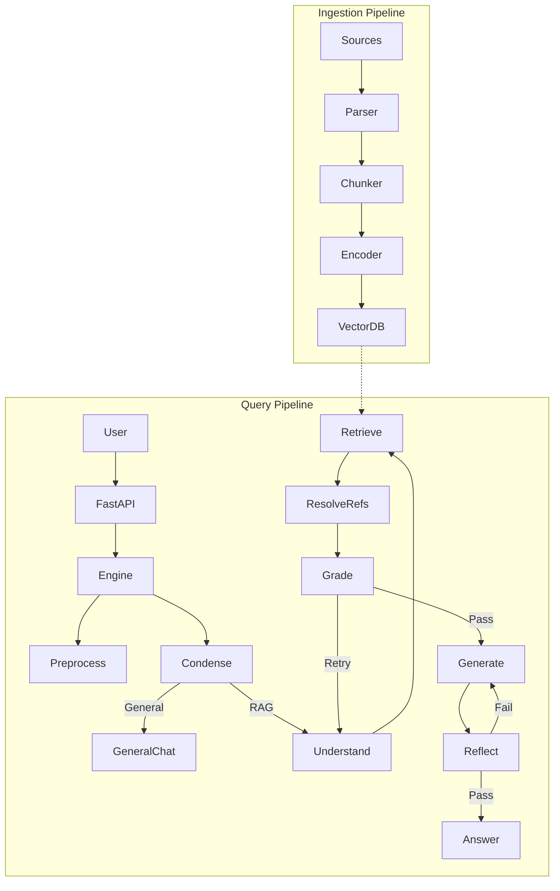
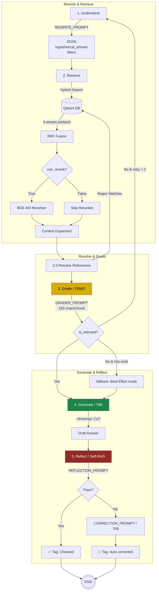
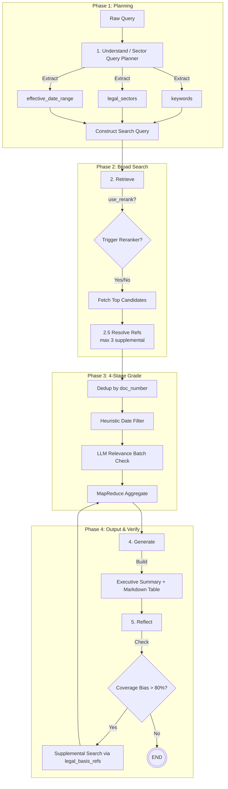
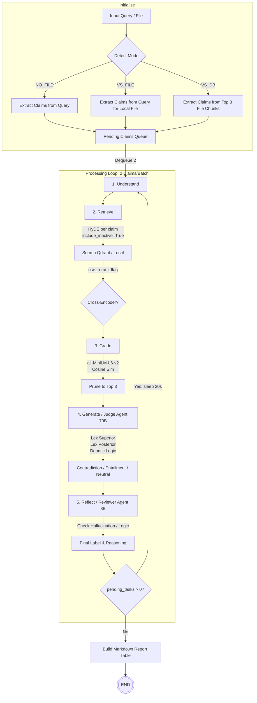

# 🏛️ Phân Tích Kiến Trúc Hệ Thống Legal-RAG — Báo Cáo Kỹ Thuật Chuyên Sâu

> Tài liệu được sinh tự động từ phân tích mã nguồn thực tế (`backend/**/*.py`, `frontend/**/*.tsx`, `scripts/**/*.py`).
> Mọi tham chiếu hàm, biến, prompt đều trích xuất 1:1 từ codebase.
> Cập nhật lần cuối: 2026-04-06.

---

## Mục Lục

1. [Tổng Quan Kiến Trúc](#1-tổng-quan-kiến-trúc)
2. [Sơ Đồ Kiến Trúc RAG Tổng Quát (End-to-End Pipeline)](#2-sơ-đồ-kiến-trúc-rag-tổng-quát)
3. [Chi Tiết Từng Bước Trong Pipeline RAG](#3-chi-tiết-từng-bước-trong-pipeline-rag)
4. [Lớp Điều Phối: `graph.py` — Universal 5-Stage RAG Pipeline](#4-lớp-điều-phối)
5. [Strategy Pattern: `strategies/` — Polymorphic Flow Dispatch](#5-strategy-pattern)
6. [Lớp Nhập Cảnh: `chat_engine.py` & `query_router.py`](#6-lớp-nhập-cảnh)
7. [Luồng LEGAL_QA — Corrective RAG (CRAG + Self-Reflection)](#7-luồng-legal_qa)
8. [Luồng SECTOR_SEARCH — MapReduce + Coverage Check](#8-luồng-sector_search)
9. [Luồng CONFLICT_ANALYZER — Sequential Batch Judging](#9-luồng-conflict_analyzer)
10. [Luồng GENERAL_CHAT — Bypass Pipeline](#10-luồng-general_chat)
11. [Lớp LLM: `llm/` — Multi-Provider Factory](#11-lớp-llm)
12. [Lớp Bộ Nhớ: `memory.py` — Kiến Trúc 2 Tầng](#12-lớp-bộ-nhớ)
13. [Lớp Hạ Tầng: Retrieval, API, Frontend, Scripts](#13-lớp-hạ-tầng)
14. [Ma Trận So Sánh Tổng Hợp](#14-ma-trận-so-sánh)
15. [Tài Liệu Tham Khảo Học Thuật](#15-tài-liệu-tham-khảo)

---

## 1. Tổng Quan Kiến Trúc

Hệ thống Legal-RAG được tổ chức theo mô hình **Agentic RAG thế hệ 3**, kết hợp:
- **CRAG (Corrective RAG)**: Retrieval Evaluator (Node `Grade`) đánh giá độ tin cậy context. Nếu kém → retry search với query viết lại.
- **Self-RAG (Self-Reflective RAG)**: Node `Reflect` tự sinh reflection tokens kiểm tra hallucination/citation/relevance.
- **HyDE (Hypothetical Document Embeddings)**: Node `Understand` yêu cầu LLM sinh "câu trả lời giả định" → embed → vector search.
- **Chain-of-Thought (CoT) cho Legal Reasoning**: Node `Generate` (Conflict Analyzer) ép LLM suy luận Lex Superior → Lex Posterior → Deontic Rules.
- **Universal 5-Stage Pipeline**: Mọi luồng chạy qua cùng một đồ thị LangGraph (Understand → Retrieve → Resolve References → Grade → Generate → Reflect).
- **Strategy Pattern**: Logic nghiệp vụ delegate cho Strategy class, đồ thị không đổi.
- **Routing Model Strategy**: Phân tầng LLM — model nhẹ (`llama-3.1-8b-instant`) cho routing/grading, model nặng (`llama-3.3-70b-versatile`) cho reasoning.

### 1.1 Sơ đồ Thành phần Cấp cao



### 1.2 Cấu trúc Thư mục Toàn Dự Án

```
Legal-RAG/
├── backend/
│   ├── __init__.py
│   ├── config.py                          # Pydantic Settings (LLM, Qdrant, Redis)
│   ├── agent/                             # === LÕI HỆ THỐNG ===
│   │   ├── state.py                       # AgentState TypedDict (Universal 5-Stage)
│   │   ├── graph.py                       # LangGraph StateGraph + Node wiring
│   │   ├── chat_engine.py                 # RAGEngine wrapper (streaming + memory)
│   │   ├── query_router.py                # Auto Intent Detection (Few-Shot LLM)
│   │   ├── strategies/                    # === STRATEGY PATTERN ===
│   │   │   ├── base.py                    # BaseRAGStrategy (ABC, 6 abstract methods)
│   │   │   ├── legal_qa.py                # LegalQAStrategy (CRAG + HyDE + Reflection)
│   │   │   ├── sector_search.py           # SectorSearchStrategy (MapReduce + Coverage)
│   │   │   └── conflict_analyzer.py       # ConflictAnalyzerStrategy (CoT Judge)
│   │   ├── utils_legal_qa.py              # Prompts + helper functions cho Legal QA
│   │   ├── utils_sector_search.py         # Prompts + helper functions cho Sector Search
│   │   ├── utils_conflict_analyzer.py     # Prompts + helper functions cho Conflict Analyzer
│   │   └── utils_general_chat.py          # Prompt + execute_general_chat()
│   ├── llm/                               # === MULTI-PROVIDER LLM FACTORY ===
│   │   ├── base.py                        # BaseLLMClient (ABC)
│   │   ├── factory.py                     # chat_completion() — Unified entry point
│   │   ├── groq_client.py                 # OpenAI-compatible (Groq) + Retry logic
│   │   ├── gemini_client.py               # Google GenAI SDK
│   │   └── ollama_client.py               # Local Ollama
│   ├── retrieval/                         # === VECTOR DB, EMBEDDING & INGESTION ===
│   │   ├── hybrid_search.py               # HybridRetriever: Dense + Sparse + RRF + Rerank
│   │   ├── embedder.py                    # BGE-M3 Dense + Sparse Encoder (PyTorch)
│   │   ├── reranker.py                    # Cross-Encoder ms-marco-MiniLM-L-6-v2
│   │   ├── chunker.py                     # AdvancedLegalChunker (Hierarchical)
│   │   ├── ingestion.py                   # process_document_task (Synchronous)
│   │   ├── remote_embedder.py             # Remote Embedding Server client
│   │   ├── server.py                      # Embedding Server (FastAPI)
│   │   ├── vector_db.py                   # Qdrant Client instance
│   │   └── base.py                        # BaseRetriever / BaseEmbedder (ABC)
│   ├── api/
│   │   └── main.py                        # FastAPI app (Chat SSE, Sessions, Upload, Ingest, Sync)
│   ├── utils/
│   │   └── document_parser.py             # PDF/DOCX parser
│   └── data/
│       └── chat_history.db                # SQLite persistent storage
├── frontend/                              # === NEXT.JS 15 UI ===
│   └── src/
│       ├── app/                           # App Router (layout.tsx, page.tsx)
│       ├── components/
│       │   ├── chat/
│       │   │   ├── ChatArea.tsx            # Main chat area (markdown, steps, references)
│       │   │   ├── ChatContainer.tsx       # Container + layout
│       │   │   ├── ChatInput.tsx           # Input box + file upload + mode selector
│       │   │   ├── LegalReference.tsx      # Collapsible legal reference cards
│       │   │   └── ModeSelector.tsx        # LEGAL_QA / SECTOR_SEARCH / CONFLICT_ANALYZER toggle
│       │   └── layout/                    # Sidebar, Header, Navigation
│       └── contexts/
│           └── ChatContext.tsx             # Global state management (SSE consumer)
├── scripts/
│   ├── core/
│   │   └── ingest_local.py                # HuggingFace → Chunker → Embedder → Qdrant bulk ingest
│   ├── crawl_legal_docs.py                # HF + Qdrant → Generate .txt/.docx/.pdf test files
│   ├── test_presets.py                    # LLM preset integration tests
│   └── tests/                             # Unit test directory
└── .env                                   # Environment variables
```

---

## 2. Sơ Đồ Kiến Trúc RAG Tổng Quát (End-to-End Pipeline)

Sơ đồ dưới đây mô tả **toàn bộ luồng dữ liệu** từ khi văn bản pháp luật được thu thập cho đến khi người dùng nhận được câu trả lời đã kiểm duyệt.

### 2.1 Macro Pipeline: Từ Document Source → User Answer



### 2.2 Data Flow Overview Table

| Giai đoạn | Input | Xử lý | Output | Model/Tool |
|:---|:---|:---|:---|:---|
| **Document Source** | HuggingFace Dataset / User Upload | Download / Upload | Raw files (.pdf, .docx, .txt) | `crawl_legal_docs.py` |
| **Parsing** | Raw file | Extract text + metadata | Plaintext + metadata dict | `document_parser.py` |
| **Chunking** | Plaintext | Hierarchical split (Chương→Điều→Khoản) + Appendix/Footer trap | Chunk objects with breadcrumb payload | `chunker.py` (Custom) |
| **Embedding** | Chunk text | Single forward pass BGE-M3 | Dense vector (1024d) + Sparse vector (Lexical Weights) | `BAAI/bge-m3` (PyTorch) |
| **Vector Store** | Vectors + Payload | Upsert with 12 indexed fields | Qdrant collection | Qdrant (`6335:6333`) |
| **Query Rewrite (HyDE)** | User query | LLM generates hypothetical answer | Rewritten query + metadata filters | `llama-3.1-8b-instant` |
| **Retrieval** | HyDE query | 4-stream Tiered Prefetch → RRF Fusion | 40 candidates | `hybrid_search.py` |
| **Reranking** | 40 candidates + query | Cross-Encoder scoring (Optional Toggle) | Top 8-15 reranked | `BAAI/bge-reranker-v2-m3` |
| **Context Expansion** | Top hits | Small-to-Big (article_id scroll) + Window Retrieval (appendix) | Expanded context text | `hybrid_search.py` |
| **Grading (CRAG)** | Truncated context + query | LLM-as-Judge relevance check | is_sufficient boolean | `llama-3.1-8b-instant` |
| **Generation** | Full XML context + query | Closed-Domain CoT answer | Draft response with citations | `llama-3.3-70b` / `Gemini 1.5 Flash` |
| **Reflection (Self-RAG)** | Draft + context + query | Hallucination/Citation/Relevance check | Final response (pass/corrected) | `llama-3.1-8b-instant` |

---

## 3. Chi Tiết Từng Bước Trong Pipeline RAG

### 3.1 Bước Chunking — `AdvancedLegalChunker` (Custom Code)

Đây là module **hoàn toàn tự viết**, xử lý đặc thù cấu trúc văn bản pháp luật Việt Nam.

```mermaid
graph TD
    subgraph INPUT ["📄 Raw Document Text"]
        RAW ["Plaintext từ PDF/DOCX Parser"]
    end

    subgraph CHUNKER ["✂️ AdvancedLegalChunker (chunker.py)"]
        direction TB
        L1 ["Line-by-line Scanner"]
        L1 --> CH_DET {"Detect Structure"}

        CH_DET -->|'Regex: ^Chương [IVXL0-9]+'| CH ["📁 Chapter<br/>current_chapter = 'Chương I. ...'"]
        CH_DET -->|'Regex: ^Mục/Phần [0-9A-Z]+'| SEC ["📂 Section<br/>current_section = 'Mục 1. ...'"]
        CH_DET -->|'Regex: ^Điều \d+'| ART ["📋 Article<br/>current_article_ref = 'Điều 5'<br/>article_preamble = [title text]"]
        CH_DET -->|'Regex: ^\d+[.)]/Khoản \d+'| CL ["📝 Clause<br/>Append to current_clauses_data"]
        CH_DET -->|'Regex: ^PHỤ LỤC/Mẫu số'| APP ["📎 Appendix Trap<br/>is_in_appendix = True<br/>MAX_APP_LEN = 2000 chars"]
        CH_DET -->|'final_article_trigger + footer_pattern'| FT ["🔚 Footer Trap<br/>Nơi nhận / Chữ ký → Appendix mode"]
        CH_DET -->|'Plain text'| TXT ["📄 Append to current clause/preamble"]

        CL --> FLUSH {"Smart Flush Rules"}
        FLUSH -->|'≥3 clauses'| FL1 ["Flush + Keep last clause overlap"]
        FLUSH -->|'2 clauses + &gt;1500 chars'| FL2 ["Flush early"]
        FLUSH -->|'any + &gt;2500 chars'| FL3 ["Force flush"]
    end

    subgraph OUTPUT ["📦 Chunk Output"]
        direction TB
        PAYLOAD ["Payload per Chunk:
        • document_id, chunk_index, chunk_id
        • document_number, title, legal_type
        • legal_sectors[], issuing_authority
        • signer_name, signer_id
        • promulgation_date, effective_date
        • is_active, is_appendix
        • chapter_ref, article_ref, clause_ref[]
        • reference_citation (breadcrumb)
        • chunk_text (formatted)
        • legal_basis_refs[] (citation graph)"]

        FORMAT ["chunk_text Format:
        [VĂN BẢN] 45/2019/NĐ-CP
        [VỊ TRÍ] Chương I &gt; Điều 5 &gt; Khoản 1-3
        [NỘI DUNG KHOẢN 1 - KHOẢN 3]
        1. Phạt tiền từ 5.000.000...
        2. Phạt tiền từ 10.000.000...
        3. Biện pháp khắc phục..."]
    end

    INPUT --> CHUNKER --> OUTPUT

    style CHUNKER fill:#2c3e50,color:#ecf0f1
    style OUTPUT fill:#1a5276,color:#fff
```

**Mô tả chi tiết hoạt động:**

Module `AdvancedLegalChunker` (`chunker.py`, ~487 LOC) là bộ phân đoạn **hoàn toàn tự viết**, được thiết kế đặc thù cho cấu trúc văn bản pháp luật Việt Nam. Không dùng bất kỳ thư viện chunking có sẵn nào (LangChain TextSplitter, LlamaIndex SentenceSplitter, v.v.) vì chúng không hiểu cấu trúc phân cấp Chương → Mục → Điều → Khoản.

**Thuật toán xử lý**: Duyệt từng dòng (`content.splitlines()`), sử dụng 6 regex patterns biên dịch trước (`re.compile`) để nhận diện cấu trúc:

```python
# Các regex patterns chính (chunker.py, __init__)
chapter_pattern  = r"(?im)^\s*(Chương\s+[IVXLCDM0-9]+)\s*(.*)$"
section_pattern  = r"(?im)^\s*((?:Mục|Phần)\s+[0-9A-ZĐ]+)\s*[\.\:\-]?\s*(.*)$"
article_pattern  = r"(?im)^\s*((?:Điều|Dieu)\s+\d+[A-Za-z0-9\/\-]*)\s*[\.\:\-]?\s*(.*)$"
clause_pattern   = r"(?im)^\s*(Khoản\s+\d+[\.\:\-]?)\s*(.*)$|^\s*(\d+[\.\)])\s*(.*)$"
appendix_pattern = r"(?im)^\s*(PHỤ LỤC|DANH MỤC|BẢNG BIỂU|Mẫu\s+số[\s\d]*)\b.*$"
footer_pattern   = r"(?i)^\s*(nơi\s+nhận|BỘ\s+TRƯỞNG|CHỦ\s+TỊCH|...)\b"
```

**Quy tắc Flush thông minh** (hàm `flush_buffer()` nội bộ): Quyết định khi nào cắt chunk mới dựa trên 3 điều kiện:

| Điều kiện | Ngưỡng | Hành vi |
|:---|:---|:---|
| Số Khoản ≥ 3 | `num_clauses >= 3` | Flush + giữ lại Khoản cuối (overlap) |
| 2 Khoản + dài | `num_clauses == 2 AND len > 1500 chars` | Flush sớm |
| Bất kỳ + quá to | `any AND len > 2500 chars` | Force flush |
| Preamble quá dài | `projected_preamble_len > 4000` | Flush + tiếp tục |
| Dòng siêu dài | `len(line) > 3000` | Chuyển sang Appendix mode |

**Đặc thù thiết kế:**
- **Preamble Inheritance**: Biến `article_preamble` luôn được đính kèm vào MỌI chunk thuộc Điều đó — đảm bảo LLM hiểu ngữ cảnh kể cả khi chỉ nhận 1 chunk.
- **Clause Overlap**: Khi flush, `current_clauses_data = [last_clause]` → chunk tiếp theo bắt đầu với Khoản cuối chunk trước, tạo **cửa sổ trượt chồng lấn** (sliding window overlap) tự nhiên theo ranh giới pháp lý.
- **Legal Basis Extraction**: Hàm `_extract_legal_basis_metadata()` quét 80 dòng đầu (`preamble[:80]`) tìm mẫu "Căn cứ Luật/Nghị định/Thông tư..." → parse ra `parent_law_id = f"parent::{doc_type}::{slug}::{year}"` dùng cho **Citation Graph** (truy vết văn bản gốc → văn bản hướng dẫn).
- **Effective Date Mining**: 4 chiến thuật phát hiện ngày hiệu lực: (1) Regex `có hiệu lực từ ngày DD/MM/YYYY`, (2) Pattern `hiệu lực từ ngày ký` → dùng `promulgation_date`, (3) Fallback sang `effective_date` từ metadata, (4) Mặc định `promulgation_date`.
- **Footer/Appendix Trap**: Biến `found_final_article` được set `True` khi phát hiện `final_article_trigger` ("có hiệu lực", "tổ chức thực hiện"). Sau đó mọi dòng khớp `footer_pattern` ("Nơi nhận", "BỘ TRƯỞNG"...) hoặc dòng UPPERCASE dài → tự động chuyển `is_in_appendix = True`.

**Chunk ID Format**: `{doc_id}::article::{article_idx}::c{global_chunk_idx}` cho Nội dung chính, `{doc_id}::appendix::{appendix_idx}::c{global_chunk_idx}` cho Phụ lục.

**chunk_text Format** (định dạng cuối cùng được embed):
```
[VĂN BẢN] 45/2019/NĐ-CP
[VỊ TRÍ] Chương I. Quy định chung > Điều 5. Hành vi vi phạm > Khoản 1 - Khoản 3
[NỘI DUNG KHOẢN 1 - KHOẢN 3]
1. Phạt tiền từ 5.000.000 đồng...
2. Phạt tiền từ 10.000.000 đồng...
3. Biện pháp khắc phục hậu quả...
```
Định dạng này giúp embedding model nhận diện rõ ràng **văn bản nào** (`[VĂN BẢN]`), **vị trí nào** (`[VỊ TRÍ]` — breadcrumb), và **nội dung Khoản nào** (`[NỘI DUNG ...]`).

### 3.2 Bước Embedding — `LocalBGEHybridEncoder` (Model: BAAI/bge-m3)

```mermaid
graph LR
    subgraph ENCODER ["🧠 BGE-M3 Encoder (embedder.py)"]
        direction TB
        INPUT_T ["Input: List[str] texts"]
        INPUT_T --> FP ["Single Forward Pass<br/>model.encode(<br/>  return_dense=True,<br/>  return_sparse=True,<br/>  return_colbert_vecs=False,<br/>  max_length=2048,<br/>  batch_size=128 (GPU) / 16 (CPU)<br/>)"]
        FP --> DENSE ["Dense Vector<br/>1024 dimensions<br/>(Cosine similarity)"]
        FP --> SPARSE ["Sparse Vector<br/>Lexical Weights (Learned)<br/>SparseVector(indices, values)"]
    end

    subgraph SINGLETON ["♻️ Singleton Cache"]
        CACHE ["_MODEL_INSTANCES dict<br/>Key: model_name_device<br/>Load once → reuse forever"]
    end

    subgraph PROXY ["🔄 Access Pattern"]
        EP ["EmbedderProxy"]
        EP -->|'Local mode'| LOC ["LocalBGEHybridEncoder<br/>(PyTorch on GPU/CPU)"]
        EP -->|'Remote mode<br/>(EMBEDDING_SERVER_URL)'| REM ["RemoteBGEHybridEncoder<br/>(HTTP API client)"]
    end

    ENCODER --- SINGLETON
    ENCODER --- PROXY

    style ENCODER fill:#1a5276,color:#fff
```

**Mô tả chi tiết hoạt động:**

Module `LocalBGEHybridEncoder` (`embedder.py`, ~130 LOC) sử dụng model **BAAI/bge-m3** từ thư viện `FlagEmbedding` để sinh cả hai loại vector trong **1 lần forward pass duy nhất**.

**Kiến trúc model BGE-M3**:
- **Base**: XLM-RoBERTa-large (550M parameters)
- **Dense output**: Mean pooling → vector 1024 chiều. Dùng cho semantic similarity.
- **Sparse output**: Lexical weights (learned) — mỗi token trong vocab nhận một trọng số. Tương tự BM25 nhưng **học được từ dữ liệu** thay vì dựa vào TF-IDF thủ công. Output: `SparseVector(indices=[token_ids], values=[weights])`.

**Công thức Cosine Similarity** (dùng cho Dense retrieval):

```
sim(q, d) = (q · d) / (‖q‖ × ‖d‖)
```

Trong đó `q` là dense embedding của query (1024d), `d` là dense embedding của document chunk (1024d).

**Sparse vector conversion** (hàm `_to_sparse_vector`):
```python
# Chuyển đổi lexical_weights dict → Qdrant SparseVector
pairs = [(int(token_id), float(weight)) for token_id, weight in weights.items() if weight != 0.0]
pairs.sort(key=lambda x: x[0])  # Sort by token_id for Qdrant
return SparseVector(indices=[idx for idx, _ in pairs], values=[val for _, val in pairs])
```

**Singleton Pattern**: `_MODEL_INSTANCES` dict giữ model đã load (key = `{model_name}_{device}`). Toàn process chỉ load 1 lần duy nhất (~2-3GB RAM cho CPU, ~1.5GB VRAM cho GPU).

**EmbedderProxy**: Proxy class dùng `__getattr__` để lazy-load. Quyết định Local vs Remote dựa trên biến môi trường `EMBEDDING_SERVER_URL`:
- Nếu có URL + không phải server → `RemoteBGEHybridEncoder` (gọi HTTP API)
- Ngược lại → `LocalBGEHybridEncoder` (load PyTorch model trực tiếp)

**Performance**: `batch_size=128` trên GPU (CUDA), `batch_size=16` trên CPU. `max_length=2048` tokens — đủ cho hầu hết chunk pháp lý (trung bình ~500-1500 chars).

### 3.3 Bước Vector Store — Qdrant Configuration

```mermaid
graph LR
    subgraph QDRANT ["💾 Qdrant Collection: legal_rag_docs_5000"]
        direction TB
        VEC ["Named Vectors:<br/>• dense: VectorParams(size=1024, distance=COSINE, on_disk=True)<br/>• sparse: SparseVectorParams(on_disk=True)"]
        IDX ["Payload Indexes (12 fields):<br/>• BOOL: is_appendix, is_active<br/>• KEYWORD: legal_type, document_number, document_id,<br/>  document_uid, article_id, chapter_ref, article_ref,<br/>  clause_ref, parent_law_ids, issuance_date, legal_sectors<br/>• TEXT: title (full-text tokenizer)"]
        POINT ["PointStruct:<br/>• id: UUID5(chunk_id)<br/>• vector.dense: float[1024]<br/>• vector.sparse: SparseVector<br/>• payload: 20+ fields"]
    end

    style QDRANT fill:#0d2137,color:#e0ffe0
```

**Mô tả chi tiết:**

Qdrant được cấu hình trong `vector_db.py` (`get_qdrant_client()`) với 2 chế độ: **Local path** (disk-based, không cần server) hoặc **URL** (kết nối tới Qdrant server qua HTTP).

**Collection schema** (thiết lập trong `ingest_local.py` → `setup_collection()`):

| Thành phần | Cấu hình | Mô tả |
|:---|:---|:---|
| Dense vector | `VectorParams(size=1024, distance=COSINE, on_disk=True)` | BGE-M3 dense embedding, lưu trên ổ cứng |
| Sparse vector | `SparseVectorParams(on_disk=True)` | BGE-M3 lexical weights, kích thước động |
| Point ID | `UUID5(chunk_id)` | Deterministic: cùng chunk_id → cùng UUID (idempotent upsert) |

**12 Payload Indexes** — tối ưu tốc độ lọc tại query time:
- **BOOL indexes** (2): `is_appendix`, `is_active` — phân tách Nội dung chính / Phụ lục, và lọc văn bản hết hiệu lực.
- **KEYWORD indexes** (9): `legal_type`, `document_number`, `document_id`, `document_uid`, `article_id` (cho Small-to-Big), `chapter_ref`, `article_ref`, `clause_ref`, `parent_law_ids` (cho Citation Graph), `issuance_date`, `legal_sectors`.
- **TEXT index** (1): `title` — full-text search với tokenizer `WORD`, `min_token_len=2`, `max_token_len=20`, `lowercase=True`.

**Payload fields** mỗi Point chứa 20+ trường metadata, bao gồm `chunk_text` (văn bản gốc đã format), `legal_basis_refs[]` (danh sách văn bản căn cứ), `reference_citation` (breadcrumb path), cho phép truy vấn phong phú mà không cần join bảng ngoài.

### 3.4 Bước Retrieval — `HybridRetriever` (Custom Code)

```mermaid
    graph TD
        subgraph RETRIEVE ["📚 HybridRetriever.search() (hybrid_search.py)"]
            direction TB
            Q ["Query text"]
            Q --> ENC ["Encode Query:<br/>dense = encode_query_dense(q)<br/>sparse = encode_query_sparse(q)"]

            ENC --> TIER ["Tiered Prefetch<br/>(4 parallel streams)"]

            TIER --> S1 ["Stream 1: Dense → Main Content<br/>(is_appendix=False, limit=40)"]
            TIER --> S2 ["Stream 2: Sparse → Main Content<br/>(is_appendix=False, limit=40)"]
            TIER --> S3 ["Stream 3: Dense → Appendix<br/>(is_appendix=True, limit=20)"]
            TIER --> S4 ["Stream 4: Sparse → Appendix<br/>(is_appendix=True, limit=20)"]

            S1 & S2 & S3 & S4 --> RRF ["RRF Fusion<br/>(Reciprocal Rank Fusion)<br/>→ 15 candidates (10 main + 5 appendix)"]

            RRF --> RERANK ["Cross-Encoder Rerank<br/>(ms-marco-MiniLM-L-6-v2)<br/>predict(query, doc_text)<br/>→ Top 15 scored"]

            RERANK --> BOOST ["Document Typology Boost:<br/>Nghị định/Luật: +0.05<br/>Nghị quyết: +0.03<br/>Phụ lục: -0.02"]

            BOOST --> EXPAND ["Context Expansion"]
            EXPAND -->|'Main Content'| S2B ["Small-to-Big:<br/>scroll by article_id<br/>→ merge all Khoản in same Điều<br/>max_neighbors=8"]
            EXPAND -->|'Appendix'| WIN ["Window Retrieval:<br/>chunk[i-1] + chunk[i] + chunk[i+1]<br/>SAME document_id + reference_citation"]
        end

        style RETRIEVE fill:#2c3e50,color:#ecf0f1
```

**Mô tả chi tiết hoạt động:**

Module `HybridRetriever` (`hybrid_search.py`, ~511 LOC) là bộ truy xuất **hoàn toàn tự viết**, orchestrate toàn bộ luồng: Encode → Prefetch → RRF → Rerank → Expand.

**Bước 1 — Query Encoding**: Gọi `embedder.encode_query_dense(q)` và `embedder.encode_query_sparse(q)` để sinh cả 2 representation cho cùng 1 câu query.

**Bước 2 — Tiered Prefetch** (hàm `broad_retrieve()`): Gửi **1 API call duy nhất** tới Qdrant với 4 luồng `Prefetch` song song:

```python
# hybrid_search.py, broad_retrieve() — 1 single Qdrant API call
client.query_points(
    collection_name=self.collection_name,
    prefetch=[
        Prefetch(query=dense_query, using="dense", limit=40, filter=main_filter),      # Luồng 1
        Prefetch(query=sparse_query, using="sparse", limit=40, filter=main_filter),    # Luồng 2
        Prefetch(query=dense_query, using="dense", limit=20, filter=appendix_filter),  # Luồng 3
        Prefetch(query=sparse_query, using="sparse", limit=20, filter=appendix_filter) # Luồng 4
    ],
    query=FusionQuery(fusion=Fusion.RRF),  # Reciprocal Rank Fusion
    limit=15,  # 10 main + 5 appendix
)
```

**Bước 3 — RRF (Reciprocal Rank Fusion)**: Qdrant tự động thực hiện RRF fusion trên server-side. Công thức RRF:

```
RRF_score(d) = Σ  1 / (k + rank_i(d))
               i∈{dense_main, sparse_main, dense_app, sparse_app}
```

Trong đó `k = 60` (hằng số smoothing mặc định của Qdrant), `rank_i(d)` là thứ hạng của document `d` trong luồng prefetch thứ `i`. Document xuất hiện ở top cả Dense lẫn Sparse sẽ được đẩy lên cao nhất.

**Bước 4 — Cross-Encoder Rerank** (hàm `reranker.rerank()`): Model `ms-marco-MiniLM-L-6-v2` (~90MB, chạy CPU) nhận cặp `(query, document_text)` và predict relevance score:

```python
# reranker.py — Build rerank text
rerank_text = f"{title}\n{citation}\n{content}"  # Gộp metadata + nội dung
pairs = [[query, rerank_text] for each candidate]
scores = cross_encoder.predict(pairs)  # → float scores
```

**Bước 5 — Document Typology Boost** (custom logic trong `search()`):
```python
if "NGHỊ ĐỊNH" in legal_type or legal_type == "LUẬT":  boost += 0.05
elif "NGHỊ QUYẾT" in legal_type:                       boost += 0.03
if is_appendix:                                         boost -= 0.02
final_score = rerank_score + boost
```
Ưu tiên văn bản cấp cao (Luật, Nghị định) hơn văn bản hành chính (Quyết định), và giảm ưu tiên Phụ lục khi đã có Nội dung chính.

**Bước 6 — Context Expansion** (hàm `expand_context()`):

- **Nội dung chính (Small-to-Big)**: Scroll Qdrant theo `article_id` + `document_id` → lấy TẤT CẢ chunk cùng Điều → sort theo `chunk_order` → ghép thành `expanded_context_text`. Giới hạn `max_neighbors=8`.
- **Phụ lục (Window Retrieval)**: Phụ lục bị cắt cứ mỗi `MAX_APP_LEN=2000` ký tự, không theo Điều/Khoản. Dùng `_window_retrieve_appendix()` lấy chunk liền trước (`i-1`) và liền sau (`i+1`) với **cùng** `document_id` + `reference_citation`. Đảm bảo không ghép nhầm Phụ lục khác nhau.

### 3.5 Bước Generation — Context Building (Custom Code)

```mermaid
graph TD
    subgraph CTX ["📝 build_legal_context() (utils_legal_qa.py)"]
        direction TB
        HITS ["All hits (raw + recursive + file_chunks)"]

        HITS --> REORD ["Strategy 1: Lost-in-the-Middle Reordering<br/>Input: [H1, H2, H3, H4, H5]<br/>Output: [H1, H3, H5, H4, H2]<br/>→ Important docs at HEAD and TAIL"]

        REORD --> XML ["Strategy 2: XML Context Injection<br/>&lt;tai_lieu id='1'&gt;<br/>  &lt;metadata&gt; nguon, vi_tri, loai_noi_dung, can_cu_phap_ly &lt;/metadata&gt;<br/>  &lt;noi_dung&gt; ... actual text ... &lt;/noi_dung&gt;<br/>&lt;/tai_lieu&gt;"]

        XML --> LIMIT ["Strategy 3: Hard Character Limit<br/>MAX_CONTEXT_CHARS = 25,000 (~3500 tokens)"]

        LIMIT --> COMPRESS ["Strategy 4: Whitespace Compression<br/>Collapse multiple spaces/newlines"]
    end

    style CTX fill:#1e8449,color:#fff
```

**Mô tả chi tiết hoạt động:**

Hàm `build_legal_context()` (`utils_legal_qa.py`) nhận danh sách hits từ bước Grade và biến đổi chúng thành một chuỗi context đơn nhất, tối ưu cho LLM consumption. Hàm áp dụng 4 chiến lược tuần tự:

**Strategy 1 — Lost-in-the-Middle Reordering** (dựa trên nghiên cứu của Liu et al., 2024): LLM có xu hướng chú ý tốt nhất vào đầu và cuối context, bỏ sót phần giữa. Thuật toán sắp xếp lại:

```python
# Thuật toán Lost-in-the-Middle (utils_legal_qa.py)
# Input sorted by relevance: [H1, H2, H3, H4, H5] (H1 = most relevant)
# Output interleaved:        [H1, H3, H5, H4, H2]
reordered = []
for i, hit in enumerate(sorted_hits):
    if i % 2 == 0:
        reordered.append(hit)        # Vị trí chẵn → đầu
    else:
        reordered.insert(len(reordered)//2, hit)  # Vị trí lẻ → giữa
```

Kết quả: Hit quan trọng nhất (`H1`) ở đầu, hit quan trọng thứ 3 (`H3`) tiếp theo, hit cuối (`H5`) ở cuối — đảm bảo LLM "nhìn thấy" thông tin quan trọng nhất.

**Strategy 2 — XML Context Injection**: Mỗi hit được bọc trong thẻ XML có cấu trúc, giúp LLM phân biệt rõ metadata vs nội dung:

```xml
<tai_lieu id="1">
  <metadata>
    <nguon>Luật Lao động 45/2019/QH14</nguon>
    <vi_tri>Chương II > Điều 5 > Khoản 1-3</vi_tri>
    <loai_noi_dung>NỘI DUNG CHÍNH</loai_noi_dung>
    <can_cu_phap_ly>Căn cứ Hiến pháp 2013...</can_cu_phap_ly>
  </metadata>
  <noi_dung>
    1. Phạt tiền từ 5.000.000 đồng...
    2. Phạt tiền từ 10.000.000 đồng...
  </noi_dung>
</tai_lieu>
```

Lý do chọn XML thay vì JSON/Markdown: XML tags giúp LLM (đặc biệt Llama) tách biệt rõ ràng giữa metadata và nội dung chính, đồng thời tương thích tốt với format `<thinking>` tags đã dùng trong CoT.

**Strategy 3 — Hard Character Limit**: `MAX_CONTEXT_CHARS = 25,000` (~3500 tokens). Được tính toán dựa trên giới hạn Free Tier Groq (12,000 TPM) để cho phép ít nhất 2 lần gọi LLM/request (1 Generate + 1 Reflect).

**Strategy 4 — Whitespace Compression**: `re.sub(r'\s*\n\s*', '\n', text)` + `re.sub(r' {2,}', ' ', text)` — loại bỏ khoảng trắng thừa, tiết kiệm ~10-15% tokens.

### 3.6 Bước Reflect — Self-RAG Anti-Hallucination (Custom Code)

```mermaid
graph TD
    subgraph SELF_RAG ["🛡️ Self-RAG Reflection (utils_legal_qa.py)"]
        direction TB
        DRAFT ["Draft Response"] --> REFL_AGENT ["Reflection Agent (8B)<br/>REFLECTION_PROMPT:<br/>1. &lt;thinking&gt; block: liệt kê MỌI trích dẫn<br/>2. Đối chiếu TỪNG trích dẫn vs Context<br/>3. Kiểm tra số liệu chính xác<br/>4. Đánh giá format trích dẫn"]

        REFL_AGENT --> CHECK {"JSON Output"}
        CHECK --> P_TRUE ["pass: true<br/>citation_ok: true<br/>hallucination_detected: false"]
        CHECK --> P_FALSE ["pass: false<br/>hallucination_detected: true<br/>feedback: 'Điều X không tồn tại...'"]

        P_TRUE --> TAG_OK ["✅ Đã qua kiểm duyệt<br/>(Reflection Agent)"]
        P_FALSE --> CORRECT ["CORRECTION_PROMPT:<br/>• Nhận feedback lỗi cụ thể<br/>• Quét lại context gốc<br/>• Viết lại hoặc từ chối trả lời<br/>• Closed-Domain nghiêm ngặt"]
        CORRECT --> TAG_FIX ["🔄 Đã tự kiểm tra<br/>và cải thiện"]
    end

    style SELF_RAG fill:#922b21,color:#fff
```

**Mô tả chi tiết hoạt động:**

Hàm `reflect_on_answer()` (`utils_legal_qa.py`) thực hiện **kiểm duyệt tự động** (Self-RAG) trên câu trả lời draft trước khi gửi cho người dùng. Quy trình 3 bước:

**Bước 1 — Reflection Check**: Gửi `REFLECTION_PROMPT` chứa cả 3 thành phần (query + context + draft) tới model `LLM_ROUTING_MODEL` (8B). Prompt yêu cầu LLM:
1. Liệt kê MỌI trích dẫn Điều/Khoản/Văn bản trong draft
2. Đối chiếu TỪNG trích dẫn với context gốc → TÌM THẤY / KHÔNG TÌM THẤY
3. Kiểm tra số liệu (mức phạt, thời hạn, tỷ lệ %) có khớp chính xác
4. Đánh giá format trích dẫn ("Căn cứ Khoản X Điều Y...")

**Bước 2 — JSON Output Parsing**: Kết quả trả về là JSON:
```json
{
  "pass": true/false,
  "hallucination_detected": true/false,
  "citation_ok": true/false,
  "feedback": "Điều 15 Khoản 3 không tồn tại trong context..."
}
```

**Bước 3 — Auto-Correction** (nếu `pass = false`): Gửi `CORRECTION_PROMPT` chứa feedback lỗi cụ thể + context gốc tới model `LLM_CORE_MODEL` (70B). Prompt ép LLM:
- Nhận biết lỗi cụ thể (ví dụ: "Điều 15 không tồn tại → thực tế là Điều 14")
- Quét lại context gốc và viết lại câu trả lời
- Nếu không thể sửa → từ chối trả lời thay vì bịa đặt
- Tuân thủ Closed-Domain nghiêm ngặt (KHÔNG dùng kiến thức ngoài)

**Output tagging**: Mỗi câu trả lời cuối cùng được gắn tag:
- `✅ Câu trả lời đã qua kiểm duyệt chất lượng (Reflection Agent).` — nếu pass lần đầu
- `🔄 Câu trả lời đã được tự kiểm tra và cải thiện bởi Reflection Agent.` — nếu phải sửa

**Ý nghĩa kiến trúc**: Self-RAG biến hệ thống từ "generate-and-pray" thành vòng lặp sinh-kiểm tra-sửa (generate-verify-correct), giảm đáng kể tỷ lệ hallucination trong domain pháp lý — nơi mà sai một chữ số (ví dụ: Điều 14 vs 15) có thể dẫn đến hậu quả pháp lý nghiêm trọng.

---

## 4. Lớp Điều Phối: `graph.py` — Universal 5-Stage RAG Pipeline

### 4.1 Cấu Trúc Dữ Liệu `AgentState`

Mọi Node đọc/ghi vào `TypedDict` dùng chung, chia 4 nhóm:

```python
class AgentState(TypedDict):
    # === Framework Core (Inputs — Không thay đổi) ===
    query: str                              # Câu hỏi gốc
    session_id: str                         # UUID phiên chat
    mode: str                               # LEGAL_QA | SECTOR_SEARCH | CONFLICT_ANALYZER | GENERAL_CHAT | AUTO
    file_path: Optional[str]                # Đường dẫn file upload
    top_k: int                              # Số kết quả mong muốn
    use_reflection: bool                    # Bật/tắt Reflection
    use_rerank: bool                        # Bật/tắt Reranking
    llm_preset: Optional[str]               # 'groq_8b', 'groq_70b', 'gemini', 'ollama'
    
    # === Trace & Memory ===
    history: List[Dict[str, str]]           # Lịch sử hội thoại
    condensed_query: str                    # Câu hỏi standalone
    file_chunks: List[Dict[str, Any]]       # Chunks từ file upload
    detected_mode: Optional[str]            # Kết quả Auto-Intent
    metrics: Annotated[Dict[str, float], operator.ior]  # Merge dict
    
    # === Universal 5-Stage RAG States ===
    rewritten_queries: List[str]            # HyDE / multi-query
    metadata_filters: Dict[str, Any]        # Qdrant filters
    raw_hits: List[Dict[str, Any]]          # Retrieval results
    recursive_hits: List[Dict[str, Any]]    # Recursive references
    filtered_context: str                   # Graded context
    is_sufficient: bool                     # CRAG router flag
    draft_response: str                     # Before reflection
    final_response: str                     # After reflection
    pass_flag: bool                         # Reflection pass/fail
    feedback: str                           # Reflection feedback
    
    # === Iterators (Batching) ===
    pending_tasks: List[Any]                # Claims queue
    completed_results: List[Any]            # Batch results
    
    # === Legacy (backward compat) ===
    answer: str                             # Output cho chat_engine
    references: Annotated[List[Dict], operator.add]  # Cộng dồn
    retry_count: int                        # Chống vòng lặp vô hạn
```

**Mô tả chi tiết:**

`AgentState` (`state.py`, 59 LOC) là **data contract duy nhất** cho toàn bộ pipeline. Mọi node đọc/ghi vào cùng 1 dict, không có side channel. Thiết kế này cho phép:

- **Traceability**: Có thể log toàn bộ state tại mỗi node để debug.
- **Atomic Routing**: Router functions (`router_grade`, `router_reflect`) quyết định routing dựa hoàn toàn trên state fields (`is_sufficient`, `pass_flag`, `pending_tasks`).
- **Reducer Pattern**: `references` sử dụng `Annotated[List, operator.add]` — mỗi node trả về list mới, LangGraph tự động cộng dồn (append). `metrics` sử dụng `operator.ior` — merge dict. Điều này cho phép Conflict Analyzer chạy nhiều vòng mà vẫn tích lũy references từ tất cả batches.
- **Backward Compatibility**: Field `answer` (legacy) được set bằng `final_response` ở node cuối cùng, đảm bảo `chat_engine.py` tiếp tục hoạt động mà không cần sửa.

**4 nhóm fields**:
1. **Framework Core** (8 fields): Inputs từ frontend, không bị node nào thay đổi.
2. **Trace & Memory** (5 fields): Trạng thái phiên (history, file_chunks, detected_mode, metrics).
3. **Universal 5-Stage** (12 fields): Data flow giữa các node RAG — mỗi strategy đọc/ghi cùng tập fields này.
4. **Iterators** (2 fields): `pending_tasks` + `completed_results` — chỉ Conflict Analyzer sử dụng cho batch loop.

### 4.2 Đồ Thị Hoàn Chỉnh

```mermaid
graph TD
    START (("(START)")) --> PRE ["node_preprocess<br/>(Load files/chunks)"]
    PRE --> COND ["node_condense<br/>(Query Rewrite + Auto Intent)"]

    COND -->|GENERAL_CHAT| GEN ["node_general_chat"]
    COND -->|RAG modes| UND ["node_understand<br/>(Strategy.understand)"]

    UND --> RET ["node_retrieve<br/>(Strategy.retrieve)"]
    RET --> REF ["node_resolve_references<br/>(Strategy.resolve_references)"]
    REF --> GRD ["node_grade<br/>(Strategy.grade)"]

    GRD -->|'is_sufficient = true'| GENA ["node_generate<br/>(Strategy.generate)"]
    GRD -->|'retry_count &lt; 2'| UND
    GRD -->|'retry_count ≥ 2 (force)'| GENA

    GENA --> REFL ["node_reflect<br/>(Strategy.reflect)"]

    REFL -->|'pass_flag = true'| DONE (("(END)"))
    REFL -->|'loop_next_batch: pending_tasks'| UND

    GEN --> DONE

    style UND fill:#1a5276,color:#fff
    style RET fill:#1a5276,color:#fff
    style REF fill:#1a5276,color:#fff
    style GRD fill:#d4ac0d,color:#000
    style GENA fill:#1e8449,color:#fff
    style REFL fill:#922b21,color:#fff
```

### 4.3 Cơ chế Routing (3 Router Functions)

| Router | Vị trí | Logic |
|:---|:---|:---|
| `router_dispatcher` | `condense →` | `GENERAL_CHAT` → bypass; else → `understand` |
| `router_grade` | `grade →` | `is_sufficient` → generate; `retry < 2` → retry; else → force generate |
| `router_reflect` | `reflect →` | `pending_tasks & !pass_flag` → loop batch; else → end |

**Mô tả chi tiết hoạt động:**

Đồ thị được xây dựng trong `graph.py` (~265 LOC) bằng `StateGraph(AgentState)` của LangGraph. Mỗi node là một hàm wrapper nhận `state` dict, gọi `get_strategy(state).method_name(state)` và trả về partial dict để merge vào state.

**`@node_timer` decorator**: Mỗi node được bọc bởi decorator đo thời gian thực thi (ms) → ghi vào `state["metrics"]`. Output: `{"metrics": {"node_understand": 1234.5}}`. Dùng cho performance monitoring.

**`get_strategy()` factory** (core của Strategy Pattern):
```python
# graph.py — Strategy factory
def get_strategy(state: AgentState) -> BaseRAGStrategy:
    mode = state.get("detected_mode") or state.get("mode", "LEGAL_QA")
    return {
        "LEGAL_QA": LegalQAStrategy(),
        "SECTOR_SEARCH": SectorSearchStrategy(),
        "CONFLICT_ANALYZER": ConflictAnalyzerStrategy(),
    }.get(mode, LegalQAStrategy())
```
Mỗi lần node chạy, factory tạo strategy instance mới (stateless) → gọi method tương ứng → trả về delta dict.

**Routing logic chi tiết:**

1. **`router_dispatcher`** (sau `condense`): Kiểm tra `state["detected_mode"]`. Nếu `GENERAL_CHAT` → nhảy sang `node_general_chat` (bypass toàn bộ RAG). Mọi mode khác → `node_understand`.

2. **`router_grade`** (sau `grade`): Logic 3 nhánh:
   - `is_sufficient = True` → `node_generate` (context tốt, generate answer)
   - `retry_count < 2 AND is_sufficient = False` → quay lại `node_understand` (CRAG retry: viết lại query)
   - `retry_count >= 2` → force `node_generate` (đã retry đủ, dùng Best-Effort)

3. **`router_reflect`** (sau `reflect`): Logic 2 nhánh:
   - `pending_tasks NOT empty AND pass_flag = False` → quay lại `node_understand` (batch loop cho Conflict Analyzer)
   - Ngược lại → `END` (hoàn tất pipeline)

**Node `node_finalize`** (node cuối ẩn): Copy `final_response` → `answer`, đảm bảo backward compatibility với `chat_engine.py` (đọc `state["answer"]`).

---

## 5. Strategy Pattern: `strategies/` — Polymorphic Flow Dispatch

### 5.1 Interface `BaseRAGStrategy` (ABC)

```python
class BaseRAGStrategy(ABC):
    @abstractmethod
    def understand(self, state) -> Dict:
        """BƯỚC 1: Phân tích & Tái cấu trúc truy vấn."""
    @abstractmethod
    def retrieve(self, state) -> Dict:
        """BƯỚC 2: Truy xuất Vector DB."""
    @abstractmethod
    def resolve_references(self, state) -> Dict:
        """BƯỚC 2.5: Truy xuất đệ quy Điều/Khoản."""
    @abstractmethod
    def grade(self, state) -> Dict:
        """BƯỚC 3: CRAG Filter."""
    @abstractmethod
    def generate(self, state) -> Dict:
        """BƯỚC 4: Sinh Output."""
    @abstractmethod
    def reflect(self, state) -> Dict:
        """BƯỚC 5: Self-Correction."""
```

### 5.2 Ma Trận Thực Hiện

| Bước | LegalQAStrategy | SectorSearchStrategy | ConflictAnalyzerStrategy |
|:---|:---|:---|:---|
| **Understand** | HyDE Rewrite + Filter | Keyword + Sector + Date Extraction | Claim IE + Batch Queue |
| **Retrieve** | Hybrid Search (expand, rerank) | Broad Fetch (rerank, no expand) | HyDE per claim (include_inactive) |
| **Resolve Refs** | Regex → recursive Điều/Khoản | Regex → max 3 refs | Regex → merge into raw_hits |
| **Grade** | Truncated CRAG (150 chars/chunk) | Dedup → Date → LLM Batch → MapReduce | Cross-Encoder Prune (all-MiniLM-L6-v2) → Top 3 |
| **Generate** | Closed-Domain Answer (70B) | Executive Summary + Markdown Table | Judge Agent CoT (70B) |
| **Reflect** | Anti-Hallucination Agent | Coverage Bias Check + Supplemental | Reviewer Agent + Batch Loop |

---

## 6. Lớp Nhập Cảnh: `chat_engine.py` & `query_router.py`

### 6.1 `RAGEngine.chat()` — Streaming Flow

```
[1] Chuẩn bị Initial State ← history từ Memory, config từ Frontend
        ↓
[2] async for event in graph.astream_events(state, version="v2")
        ↓ on_node_start → yield {type: "step", content: "📚 Đang tìm kiếm..."}
        ↓ on_chain_end name="LangGraph" → final_state
        ↓ (hoặc CancelledError nếu user disconnect)
[3] Lưu Memory: add_message("user", query) + add_message("assistant", answer)
[4] yield {type: "final", content: {answer, references, session_id, title, detected_mode}}
```

**Mô tả chi tiết hoạt động:**

Class `RAGEngine` (`chat_engine.py`, 114 LOC) là điểm nhập duy nhất cho toàn bộ hệ thống RAG. Nó wrap LangGraph graph và cung cấp async generator cho SSE streaming.

**SSE Event Types** (3 loại):
| Event Type | Trigger | Payload |
|:---|:---|:---|
| `step` | `on_node_start` | `{type: "step", content: "📚 Đang tìm kiếm..."}` |
| `final` | `on_chain_end name="LangGraph"` | `{type: "final", content: {answer, references, session_id, ...}}` |
| `error` / `cancelled` | Exception / `CancelledError` | `{type: "error", content: "Lỗi..."}` |

**Node-to-Message mapping** (`self.node_messages` dict): Mỗi node name được map sang thông báo user-friendly bằng tiếng Việt. Ví dụ: `"retrieve"` → `"📚 Đang tìm kiếm cơ sở dữ liệu pháp luật..."`. Frontend hiển thị các bước này dưới dạng animated progress indicators.

**Memory commit**: Chỉ thực hiện SAU KHI pipeline hoàn tất — đảm bảo nếu user disconnect giữa chừng (`CancelledError`), không có partial data bị ghi vào database.

**Cancellation support**: `async for event in self.graph.astream_events(...)` tự động raise `CancelledError` khi FastAPI phát hiện client disconnect (thông qua `fastapi_request.is_disconnected()` trong `api/main.py`).

### 6.2 `QueryRouter` — Phân loại Ý đồ

**Mô tả chi tiết:** `QueryRouter` (`query_router.py`) là bộ phân loại ý đồ (intent classifier) sử dụng Few-Shot LLM prompting. Nó nhận câu hỏi gốc và quyết định luồng RAG nào sẽ xử lý.

- **Few-Shot Prompting**: 10 ví dụ mẫu trong system prompt, bao gồm cả edge cases (ví dụ: "Tôi muốn kiểm tra nội quy" → `CONFLICT_ANALYZER`, "Chào bạn" → `GENERAL_CHAT`)
- **Model**: `LLM_ROUTING_MODEL` (`llama-3.1-8b-instant`) — model nhẹ, latency thấp (~0.3s)
- **Output**: JSON `{"intent": "LEGAL_QA|SECTOR_SEARCH|CONFLICT_ANALYZER|GENERAL_CHAT"}`
- **Fallback**: `LEGAL_QA` nếu JSON parse lỗi — đảm bảo hệ thống không bao giờ stuck
- **Condense logic**: Nếu có `history` (multi-turn), gọi thêm `condense_question()` để biến câu hỏi follow-up thành standalone query (ví dụ: "Còn về điều 5 thì sao?" → "Điều 5 Luật Lao động 2019 quy định gì?")

---

## 7. Luồng LEGAL_QA — Corrective RAG (CRAG + Self-Reflection)

Luồng phức tạp nhất với **2 vòng lặp đệ quy** (CRAG retry + Reflection retry).

### 7.1 Pipeline Chi tiết



### 7.1A Ánh xạ với Hạ tầng RAG lõi
Luồng **LEGAL_QA** sử dụng các module lõi (đã trình bày ở Phần 2 & 3) một cách toàn diện để đảm bảo độ chính xác tuyệt đối:
- **Chunking & Vector Store**: Khai thác triệt để cấu trúc chỉ mục (12 indexed fields) của `AdvancedLegalChunker` trên Qdrant thông qua các bộ lọc (`metadata_filters`) sinh ra từ bước Understand (HyDE).
- **Retrieval**: Gọi `HybridRetriever` với `expand_context=True`. Kích hoạt tính năng **Context Expansion** (Small-to-Big) để LLM có ngữ cảnh nguyên vẹn của toàn bộ Điều luật thay vì chỉ lấy một Khoản đơn lẻ. Điều này là thiết yếu để ráp nối chính xác các quy định loại trừ (VD: "Trừ các trường hợp sau đây...").
- **Reranking**: Cờ `use_rerank` được mapping trực tiếp xuống `HybridRetriever`. Việc bật tính năng sinh ra điểm cực chuẩn nhờ Cross-Encoder `BAAI/bge-reranker-v2-m3` tối đa hóa độ chính xác, hoặc có thể tắt trên UI để kích hoạt độ phản hồi tốc độ cho thiết bị Local.
- **Generation**: Sử dụng `build_legal_context()` áp dụng kỹ thuật **Lost-in-the-Middle** Reordering và **XML Context Injection** để đẩy dữ liệu Context tinh gọn vào model 70B phục vụ suy luận CoT.

**Mô tả chi tiết hoạt động từng bước:**

**Bước 1 — Understand (HyDE)**: Hàm `rewrite_legal_query()` (`utils_legal_qa.py`) gửi `REWRITE_PROMPT` tới model 8B. Prompt yêu cầu LLM phân tích câu hỏi và trả về JSON:
```json
{
  "hypothetical_answer": "Theo Điều 5 Luật Lao động 2019, người sử dụng lao động phải...",
  "filters": {
    "legal_type": "Luật",
    "doc_number": null,
    "is_appendix": false,
    "article_ref": "Điều 5"
  }
}
```
`hypothetical_answer` là câu trả lời giả định (HyDE) — khi embed nó, vector sẽ gần hơn với các chunk chứa câu trả lời thật so với embedding trực tiếp câu hỏi. Đây là ý tưởng core của HyDE (Gao et al., 2023).

**Bước 2 — Retrieve**: `LegalQAStrategy.retrieve()` gọi `retriever.search()` với `expand_context=True`, `use_rerank=True`, và các metadata filters từ bước 1. Nếu filters quá khắt khe (0 kết quả) → fallback: drop tất cả filters và search lại.

**Bước 2.5 — Resolve References**: Hàm `resolve_recursive_references()` quét text của mỗi hit bằng 4 regex patterns:
```python
patterns = [
    r"Điều\s+(\d+)",           # "Điều 5" → tìm chunk Điều 5
    r"Phụ\s+lục\s+([\d\w]+)",  # "Phụ lục I" → tìm chunk Phụ lục I
    r"Phụ\s+lục\s+([IVXLCDM]+)", # "Phụ lục III" (La Mã)
    r"Khoản\s+(\d+)\s+Điều\s+(\d+)"  # "Khoản 2 Điều 10"
]
```
Mỗi match → gọi `retrieve_specific_reference()` để fetch chunk bổ sung từ Qdrant. Giới hạn tối đa 5 supplemental hits.

**Bước 3 — Grade (CRAG)**: `LegalQAStrategy.grade()` thực hiện **Truncation Grading** — chỉ gửi 150 ký tự đầu của mỗi chunk tới model 8B để tiết kiệm tokens. Logic 3 nhánh:
- `is_relevant = True` → tiến tới Generate
- `is_relevant = False AND hits exist` → **Best-Effort mode** (vẫn generate nhưng gắn disclaimer)
- `is_relevant = False AND no hits` → trả về "Không tìm thấy quy định..."

### 7.2 ANSWER_PROMPT — Key Rules
- **Closed-Domain tuyệt đối**: "KHÔNG BAO GIỜ SỬ DỤNG KIẾN THỨC CÓ SẴN" — dù LLM biết câu trả lời, vẫn phải từ chối nếu context không chứa
- **Mandatory `<thinking>` block**: Chain-of-Thought bắt buộc trước khi trả lời:
  1. Quét tiêu đề các `<tai_lieu>` → xác định nguồn nào liên quan
  2. Trích xuất thô thông tin từ `<noi_dung>` → map Điều/Khoản
  3. Giải quyết xung đột Lex Superior/Posterior nếu có
  4. Xác định cách trích dẫn: "Căn cứ Khoản X Điều Y văn bản Z"
- Nếu context không đủ → "Xin lỗi, dữ liệu hiện tại..."
- Trích dẫn chính xác "Căn cứ Khoản X Điều Y văn bản Z"
- Ưu tiên nguồn: Luật → Nghị định → Thông tư | NỘI DUNG CHÍNH → PHỤ LỤC

---

## 8. Luồng SECTOR_SEARCH — MapReduce + Coverage Check

### 8.1 Pipeline



### 8.1A Ánh xạ với Hạ tầng RAG lõi
Trong luồng **SECTOR_SEARCH**, mục đích là rà quét và phân loại vĩ mô thay vì đọc hiểu chi tiết. Cụ thể hóa trên các module lõi:
- **Retrieval**: Gọi `HybridRetriever` nhưng thiết kế tham số **`expand_context=False`**. Hệ thống sẽ truy xuất top các chunks nhưng không tốn tài nguyên chạy quá trình thu thập và ghép nối lân cận (Small-to-Big/Window Retrieval), giữ mọi thứ nhẹ nhàng vì chỉ cần sử dụng Metadata (Số hiệu, Ngày ban hành) của chunk cho việc rải data vào DataFrame.
- **Reranking**: Tính năng Rerank của Cross-Encoder (`BAAI/bge-reranker-v2-m3`) vẫn có thể dùng tùy chọn thông qua cờ `use_rerank` để lọc chuẩn xác các văn bản có định hướng ngành (Legal Sectors).
- **Grading & Generation**: Lược bỏ bước CRAG Evaluation trên từng Chunk như của `LEGAL_QA`. Luồng sử dụng **LLM Batch Relevance Check** cho phép LLM duyệt danh sách nhiều Docs chỉ bằng 1 Call, sau đó gộp nội dung (MapReduce) để ra bảng Markdown, vì vậy không áp dụng Self-RAG.

**Mô tả chi tiết hoạt động:**

Luồng Sector Search được thiết kế cho truy vấn dạng "Tìm tất cả văn bản pháp luật về [chủ đề X]" — output là **bảng tổng hợp** thay vì câu trả lời dạng paragraph. Sử dụng ít LLM calls (3-4) nhưng nặng về logic Python.

**Bước 1 — Understand**: Hàm `transform_sector_query()` (`utils_sector_search.py`) trích xuất keywords, legal_sectors[], và effective_date_range từ câu hỏi. Nếu có file upload, gọi thêm `analyze_document_focus()` để phân tích trọng tâm tài liệu và gộp keywords bổ sung.

**Bước 2 — Retrieve**: Khác với Legal QA (`expand_context=True`), Sector Search dùng `expand_context=False` vì chỉ cần metadata để xây bảng tổng hợp, không cần toàn bộ văn bản Điều luật. Vẫn bật `use_rerank=True` để đảm bảo chất lượng.

### 8.2 Grade: 4-Stage Filter

| Sub-step | Method | LLM? |
|:---|:---|:---:|
| Dedup by `document_number` | Python dict (keep highest score) | ❌ |
| Heuristic Date Filter | Regex year extraction + range check | ❌ |
| LLM Relevance Batch | 1 LLM call, compact metadata format | ✅ |
| MapReduce Aggregate | Python grouping → Markdown table | ❌ |

### 8.3 Reflect: Coverage Bias Check

```python
EXPECTED_COMPANIONS = {
    "Luật": ["Nghị định", "Thông tư"],
    "Nghị định": ["Thông tư", "Luật"],
    "Thông tư": ["Nghị định"],
    "Nghị quyết": ["Nghị định", "Luật"],
}
```
Nếu 1 loại chiếm >80% → supplemental search qua `legal_basis_refs` → bổ sung.

**Mô tả chi tiết Grade pipeline:**

**Sub-step 1 — Dedup by `document_number`**: Hàm `deduplicate_by_document()` nhóm tất cả chunks theo `document_number` → giữ chunk có `score` cao nhất cho mỗi document. Ví dụ: 15 chunks từ 5 văn bản → 5 unique docs.

**Sub-step 2 — Heuristic Date Filter**: Hàm `_heuristic_date_filter()` dùng regex trích xuất năm từ `issuance_date` (format `DD/MM/YYYY`) → so sánh với `effective_date_range` (nếu user chỉ định "luật ban hành từ 2020"). Hoàn toàn Python, không tốn token.

**Sub-step 3 — LLM Relevance Batch** (1 LLM call duy nhất): Hàm `grade_relevance_batch()` gửi toàn bộ danh sách docs dạng compact:
```
1. [Luật] 45/2019/QH14 - Luật Lao động (Score: 0.85)
2. [Nghị định] 145/2020/NĐ-CP - Quy định chi tiết... (Score: 0.72)
...
```
Model 8B trả về danh sách IDs cần giữ. Tiết kiệm token so với grade từng doc riêng.

**Sub-step 4 — MapReduce Aggregate**: Hàm `map_reduce_aggregate()` nhóm docs theo `legal_type` → sinh Markdown table:
```
| STT | Loại văn bản | Số hiệu | Tên văn bản | Ngày ban hành | Hiệu lực |
|:---:|:-------------|:--------|:------------|:-------------|:--------|
| 1   | Luật         | 45/2019 | Bộ Luật LĐ  | 20/11/2019   | ✅ Còn   |
```

**Reflect — Coverage Bias Check**: Hàm `check_coverage_bias()` phân tích phân bố `legal_type` trong kết quả. Nếu 1 loại chiếm >80% (ví dụ: toàn Luật, thiếu Nghị định hướng dẫn) → gọi `supplemental_search_by_basis()` lấy thêm văn bản hướng dẫn qua `legal_basis_refs` (citation graph). Rebuild bảng với kết quả bổ sung.

**Công thức Coverage Bias**:
```
bias_ratio = count(dominant_type) / total_docs
if bias_ratio > 0.8 AND len(missing_types ∩ EXPECTED_COMPANIONS[dominant_type]) > 0:
    trigger supplemental search
```

---

## 9. Luồng CONFLICT_ANALYZER — Sequential Batch Judging

Luồng nặng nhất, sử dụng **CoT Legal Reasoning** + **3 Workflow modes**. Đây là luồng duy nhất sử dụng **loop batching** — xử lý tuần tự 2 claims/batch để tránh vượt Rate Limit Free Tier.

### 9.1 Pipeline



### 9.2 Three Workflow Modes (Intent Router)

| Mode | Trigger | Claim Source | Search Target |
|:---|:---|:---|:---|
| `NO_FILE` | No file attached | Extract from query text | Qdrant DB |
| `VS_FILE` | File + query about file | Extract from query | File chunks (local) |
| `VS_DB` | File + general check | Extract from file chunks[:3] | Qdrant DB |

### 9.3 Judge Agent — Chain-of-Thought (CoT) Legal Reasoning

**JUDGE_PROMPT** ép LLM suy luận qua 5 bước trong `<thinking>`:
1. **Lex Superior** (Thứ bậc): Luật > Nghị định > Thông tư > Nội quy
2. **Lex Posterior** (Thời gian): Phát hiện `is_active=False` → cảnh báo quy định hết hiệu lực
3. **Deontic Logic**: MUST vs MUST NOT vs MAY
4. **Xác định trích dẫn**: Điều/Khoản vs Phụ lục vs Nội dung chung
5. **Kết luận**: Contradiction | Entailment | Neutral

**Reviewer Agent** kiểm tra chéo: chống hallucination + hermeneutic fallacy.

### 9.3A Ánh xạ với Hạ tầng RAG lõi
**CONFLICT_ANALYZER** là luồng có cách tiếp cận khắt khe nhất với hạ tầng biến hoá nhất:
- **Retrieval đặc thù**: Gọi `HybridRetriever` kèm tham số `include_inactive=True`. Mục tiêu là lục lại cả kho Qdrant để tìm cả những văn bản **đủ điều kiện Lex Posterior** (đã hết hiệu lực hoặc bị thay thế).
- **Reranking độc lập**: Không sử dụng chung BGE-M3 Reranker của hệ thống. Thay vào đó, sau khi Qdrant ném ra hit, luồng dùng model NLP local chuyên biệt (`all-MiniLM-L6-v2`) để **chấm điểm Cosine Sim** cực kì gắt gao giữa từng *Mệnh đề nguyên tử* (Claim) với *Đoạn văn bản* (Chunk) nhằm loại ngay lập tức (Pruning) những văn bản trả về điểm thấp trước khi đưa cho General LLM.

**Mô tả chi tiết hoạt động:**

**Bước 1 — Understand (Init phase)**: Hàm `extract_claims_from_text()` (`utils_conflict_analyzer.py`) gửi `IE_PROMPT` tới model 8B. Prompt phân rã văn bản thành các **nguyên tử Deontic** (Chủ thể + Hành vi + Điều kiện + Hệ quả). Chỉ trích xuất câu chứa NGHĨA VỤ/LỆNH CẤM/KHOẢN THU, bỏ qua câu ĐỊNH NGHĨA/GIỚI THIỆU.

**Batching**: Mỗi vòng lặp rút `batch_size=2` claims từ `pending_tasks` queue. Trước mỗi batch (trừ lần đầu), `time.sleep(20)` để refill Groq TPM quota (Free Tier giới hạn 6,000 tokens/phút cho 70B).

**Bước 2 — Retrieve (HyDE per claim)**: Hàm `hyde_retrieve()` sinh câu query giả định bằng `HYDE_PROMPT` (chuyển ngôn ngữ đời thường thành văn phong pháp lệnh). Đặc biệt: `include_inactive=True` để có thể phát hiện **Lex Posterior** (luật mới thay thế luật cũ).

**Bước 3 — Grade (Cross-Encoder Prune)**: Hàm `cross_encoder_prune_with_scores()` dùng model local `all-MiniLM-L6-v2` (~90MB, CPU) tính Cosine Similarity giữa claim text và mỗi hit:

```
sim(claim, doc) = (claim_emb · doc_emb) / (‖claim_emb‖ × ‖doc_emb‖ + ε)
```

Giữ Top 3 hits có score cao nhất. Nếu `max_score < 0.2` → đánh dấu `is_best_effort = True`.

**Bước 4 — Generate (Judge Agent)**: Hàm `judge_claim()` gửi `JUDGE_PROMPT` tới model 70B. Prompt ép LLM suy luận qua **5 bước trong `<thinking>` block**:
1. **Lex Superior**: So sánh thứ bậc cơ quan ban hành (Quốc hội > Chính phủ > Bộ > Công ty)
2. **Lex Posterior**: Phát hiện `is_active=False` → cảnh báo quy định hết hiệu lực
3. **Deontic Logic**: MUST (bắt buộc) vs MUST NOT (cấm) vs MAY (tùy nghi)
4. **Xác định trích dẫn**: Format "Căn cứ [Loại VB] [Số hiệu] - Điều X, Khoản Y"
5. **Kết luận**: `Contradiction` (xung đột) | `Entailment` (hợp pháp) | `Neutral` (không quy định)

**Bước 5 — Reflect (Reviewer Agent + Loop Controller)**: `review_claim()` gửi phán quyết của Judge tới model 8B để kiểm tra chéo:
- Đối chiếu trích dẫn Điều/Khoản → TÌM THẤY / KHÔNG TÌM THẤY (chống hallucination)
- Kiểm tra logic: Judge có bắt bẻ cứng nhắc không? (ví dụ: "luật không cấm" → nên là Neutral, không phải Contradiction)
- Nếu Judge sai → Reviewer sửa label + reasoning

**Loop Controller**: Nếu `pending_tasks` còn claims → set `pass_flag = False` → `router_reflect` quay đầu về `node_understand` chạy batch tiếp. Nếu hết → build Markdown report table.

**Output Report** (Markdown table):
```
| Mệnh đề Nội quy (Claim) | Phán quyết | Căn cứ Pháp lý | Giải thích chi tiết |
| :--- | :---: | :--- | :--- |
| NLĐ nghỉ 30 ngày/năm | ❌ Contradiction | Căn cứ Điều 113 BLLĐ 2019 | Luật quy định 12 ngày/năm... |
```

**Đề xuất DB Update**: Nếu Judge phát hiện văn bản mới thay thế cũ (Lex Posterior) → output chứa hidden HTML comment `<!-- DB_UPDATE_PROPOSAL: {...} -->` + thông báo user. Frontend có thể gọi `/api/documents/sync-conflict` để đánh dấu `is_active=False` cho văn bản cũ.

---

## 10. Luồng GENERAL_CHAT — Bypass Pipeline

**Mô tả chi tiết:**

Luồng đơn giản nhất, **không sử dụng RAG pipeline**. Được kích hoạt khi `QueryRouter` phát hiện câu hỏi không liên quan đến pháp luật (chào hỏi, hỏi thời tiết, v.v.).

- **Flow**: `START → node_preprocess → node_condense → node_general_chat → END` (chỉ 3 node)
- **System prompt**: "Bạn là Trợ lý AI thông minh, thân thiện. Hãy trả lời câu hỏi một cách ngắn gọn."
- **Context window**: 10 tin nhắn gần nhất từ Redis/local memory (`history[-10:]`)
- **Model**: `LLM_ROUTING_MODEL` (`llama-3.1-8b-instant`) — model nhẹ, response nhanh (~0.5s)
- **Không sử dụng**: Qdrant, HyDE, Grading, Reflection, file_chunks
- **Hàm chính**: `execute_general_chat()` (`utils_general_chat.py`) — 1 lần gọi `chat_completion()` duy nhất
- **Output**: `state["answer"]` trực tiếp (không qua `draft_response` / `final_response`)

---

## 11. Lớp LLM: `llm/` — Multi-Provider Factory

### 11.1 Kiến trúc

```mermaid
graph TD
    CALL ["chat_completion(messages, model)"] --> FACTORY ["factory.py (Lazy Load)"]
    FACTORY -->|provider=groq| GROQ ["GroqClient (OpenAI SDK)"]
    FACTORY -->|provider=gemini| GEMINI ["GeminiClient (Google GenAI)"]
    FACTORY -->|provider=ollama| OLLAMA ["OllamaClient (Local)"]
    
    GROQ --> API_GROQ ["Groq Cloud API"]
    GEMINI --> API_GEMINI ["Google Gemini API"]
    OLLAMA --> LOCAL ["Local Ollama Server"]
```

**Mô tả chi tiết:**

Hệ thống thiết kế Pattern Factory (`llm/factory.py`) để trừu tượng hóa các nhà cung cấp LLM, cho phép dễ dàng chuyển đổi cấu hình mà không cần sửa code business logic. Cấu trúc gồm:
- **`BaseLLMClient` (Interface)**: Định nghĩa hàm `chat_completion()` và `astream_chat_completion()`.
- **Concrete Clients**: `GroqClient` (dùng thư viện openai tương thích API), `GeminiClient` (Google GenAI), `OllamaClient` (Local instance).
- **Factory method `get_llm_client(preset)`**: Load lazy (chỉ khởi tạo khi cần). Cho phép người dùng chuyển qua lại giữa các Provider thông qua config `LLM_PRESET`.

### 11.2 Routing Model Strategy

| Tầng | Model | Config Key | Dùng cho |
|:---|:---|:---|:---|
| **Routing** (nhẹ) | `llama-3.1-8b-instant` | `LLM_ROUTING_MODEL` | Query Rewrite, Intent, CRAG Grade, Reflection, IE, HyDE, Reviewer, Summary, Title |
| **Core** (nặng) | `llama-3.3-70b-versatile` | `LLM_CORE_MODEL` | Answer Generation (Legal QA), Judge Agent (Conflict) |

**Mô tả chi tiết:**

Hệ thống phân chia 2 loại model nhằm cân bằng giữa Cost, Latency và Quality:
- **Routing/Light Model**: Xử lý các task ngắn, logic đơn giản (Rewrite, Intent, RAG Grade, Reflect). Yêu cầu tốc độ cực nhanh (< 1s). Mặc định dùng `llama-3.1-8b-instant` trên Groq.
- **Core/Heavy Model**: Xử lý task sinh văn bản, phân tích văn bản dài, và CoT reasoning dài. Yêu cầu tính chính xác cao. Mặc định dùng `llama-3.3-70b-versatile` trên Groq.

**Xử lý Rate Limit & Backoff**: Việc sử dụng LLM trên mây, đặc biệt ở Free Tier (Groq), rất dễ dính HTTP 429 Code (Rate Limit Exceeded). `BaseLLMClient` thực thi Decorator `@retry_with_backoff`:
- Bắt lỗi `RateLimitError` và `APIConnectionError`.
- Logic Exponential Backoff: `delay = initial_delay * (2 ^ attempt) + random(0, 2)`.
- Mặc định sleep 20s cho lần thử lại đầu tiên để Groq kịp reset "Tokens per Minute" bucket.

---

## 12. Lớp Bộ Nhớ: `memory.py` — Kiến Trúc 2 Tầng

```mermaid
graph TD
    subgraph "Tầng 1: Short-term (Redis)"
        R ["Redis Key: session:{id}"]
        R -->| "TTL 24h" | RL ["Rolling Window: 14 messages"]
    end
    subgraph "Tầng 2: Long-term (SQLite)"
        S ["Table: sessions"]
        M ["Table: messages"]
        S --- M
    end
    subgraph "Tầng 0: Ephemeral (RAM)"
        TC ["temp_chunks: Dict[session_id, chunks[]]"]
    end
```

- **Inline Edit**: `delete_last_turn()` xóa 2 messages cuối → sync Redis

**Mô tả chi tiết:**

Lớp Bộ nhớ (`memory.py`) đóng vai trò lưu trữ trạng thái đối thoại nhiều phiên (multi-turn).
- **Tầng 0 (RAM - temp_chunks)**: Lưu tạm file chunks user vừa upload theo `session_id`. Rất nhanh, bị xoá nếu server restart, chỉ sống cho phiên hiện tại.
- **Tầng 1 (Redis)**: Short-term memory. Dữ liệu tin nhắn (`history`) được Serialize dưới format JSON và lưu vào Redis dạng string `key=session:{id}`. Redis lưu `TTL = 24h`. Các node RAG tương tác trực tiếp với Redis để lấy memory (rất nhanh). Maintain giới hạn "Rolling Window" max 14 messages để không làm tràn LLM context window. Giúp frontend giữ được state giữa các lần reload.
- **Tầng 2 (SQLite)**: Long-term storage lưu vĩnh viễn (các bảng `sessions`, `messages`). Background worker (hoặc sync run) sẽ sync từ Redis xuông SQLite phục vụ cho History Tab ở UI.
- Lúc Frontend yêu cầu tạo Session mới: LLM chạy task sinh `Auto-Title` ngầm dựa vào tin nhắn đầu tiên của User để đặt title cho phiên trò chuyện.

---

## 13. Lớp Hạ Tầng: Retrieval, API, Frontend, Scripts

### 13.1 API Layer (`api/main.py`)

| Endpoint | Method | Chức năng |
|:---|:---:|:---|
| `/health` | GET | Health check |
| `/api/chat` | POST | **SSE Streaming** chat (async + cancellation) |
| `/api/sessions` | GET/POST | List / Create sessions |
| `/api/sessions/{id}/messages` | GET | Full chat history |
| `/api/sessions/{id}/title` | PUT | Update title |
| `/api/sessions/{id}` | DELETE | Delete session |
| `/api/sessions/{id}/last-turn` | DELETE | Delete last turn (inline edit) |
| `/api/upload` | POST | Upload file + parse chunks to RAM |
| `/api/ingest` | POST | Permanent ingest to Qdrant (duplicate check + direct execution) |
| `/api/documents/sync-conflict` | POST | Deactivate old docs + trigger re-ingest |

### 13.2 Frontend (`frontend/src/`)

| File | Vai trò |
|:---|:---|
| `contexts/ChatContext.tsx` | Global state: SSE consumer, session management, file upload state |
| `components/chat/ChatArea.tsx` | Main chat area: markdown render, step indicators, reference cards |
| `components/chat/ChatInput.tsx` | Input box + file upload + mode selector integration |
| `components/chat/ChatContainer.tsx` | Layout container |
| `components/chat/LegalReference.tsx` | Collapsible legal reference cards (title, article, score, URL) |
| `components/chat/ModeSelector.tsx` | LEGAL_QA / SECTOR_SEARCH / CONFLICT_ANALYZER / AUTO toggle |

### 13.3 Scripts (`scripts/`)

| File | Vai trò |
|:---|:---|
| `core/ingest_local.py` | **Bulk Ingest**: HuggingFace → Chunker → BGE-M3 Hybrid Encode → Qdrant upsert (batch 100) |
| `crawl_legal_docs.py` | **Test Data Generator**: DB metadata → HF content → balanced sampling → .txt/.docx/.pdf |
| `test_presets.py` | LLM preset integration tests |

### 13.4 Ingestion Pipeline (`retrieval/ingestion.py`)

**Synchronous Ingest**:
```
upload file → parse_and_chunk() → LLM summary → encode(Dense+Sparse) → Qdrant upsert
```
Duplicate check by `document_number` trước khi thực hiện (tránh tình trạng duplicate embeddings cho update file).

**Mô tả chi tiết hạ tầng:**

- **Backend (FastAPI)**: Đóng vai trò là entrypoint nhận requests từ Next.js UI. Tận dụng `async/await` của FastAPI tối ưu IO bound kết hợp `Server-Sent Events (SSE)` (trong route `/api/chat`) để truyền các events của luồng graph đến Frontend theo thời gian thực (ví dụ như đang truy xuất, đang chấm điểm, ...). 
- **Frontend (Next.js + Tailwind + Context API)**: 
  - `ChatContext.tsx`: Quản lý toàn cục `session_id`, states đang loading/streaming của luồng RAG. Xử lí nhận stream chunk từ EventSource của trình duyệt. 
  - `LegalReference.tsx`: Component React chuyên biệt để tái cấu trúc lại Metadata hiển thị trích dẫn (như Số hiệu luật, Điều khoản) đẹp mắt.
  - Hỗ trợ auto resize textarea, scroll to bottom tự động.
- **Ingestion**: Xử lý các file ingestion (Parsing file PDF/DOCX, BGE-M3 Chunking/Embedding, Qdrant IO) trực tiếp bên trong FastAPI endpoint một cách đồng bộ.
---

## 14. Ma Trận So Sánh Tổng Hợp

| **Batch Loop?** | ❌ | ❌ | ✅ (2 claims/batch) | ❌ |
| **Coverage Check?** | ❌ | ✅ | ❌ | ❌ |
| **Local Model** | ❌ | ❌ | all-MiniLM-L6-v2 | ❌ |
| **Context Strategy** | XML + Lost-in-Middle | Markdown Table | XML truncated (3000 chars) | History only |
| **Anti-Hallucination** | Reflection Agent + Correction | ❌ | Reviewer Agent | ❌ |
| **Latency** | 3s–8s | 2s–4s | 30s–120s | 0.5s–1s |

---

## 15. Tài Liệu Tham Khảo Học Thuật

| # | Kỹ thuật | Nguồn | Áp dụng trong Hệ thống |
|:---:|:---|:---|:---|
| 1 | **CRAG (Corrective RAG)** | Yan et al., "Corrective Retrieval Augmented Generation", 2024 [[arXiv:2401.15884]](https://arxiv.org/abs/2401.15884) | Node `Grade`: Retrieval Evaluator kiểm định context → retry search nếu kém |
| 2 | **Self-RAG** | Asai et al., "Self-RAG: Learning to Retrieve, Generate, and Critique", NeurIPS 2023 [[arXiv:2310.11511]](https://arxiv.org/abs/2310.11511) | Node `Reflect`: LLM sinh reflection tokens kiểm tra hallucination/citation/relevance |
| 3 | **HyDE** | Gao et al., "Precise Zero-Shot Dense Retrieval without Relevance Labels", ACL 2023 [[arXiv:2212.10496]](https://arxiv.org/abs/2212.10496) | Node `Understand`: LLM sinh "câu trả lời giả định" → embed → vector search |
| 4 | **Chain-of-Thought (CoT)** | Wei et al., "Chain-of-Thought Prompting Elicits Reasoning", NeurIPS 2022 [[arXiv:2201.11903]](https://arxiv.org/abs/2201.11903) | Node `Generate` (Conflict): Lex Superior → Lex Posterior → Deontic → Kết luận |
| 5 | **Lost-in-the-Middle** | Liu et al., "Lost in the Middle: How Language Models Use Long Contexts", TACL 2024 [[arXiv:2307.03172]](https://arxiv.org/abs/2307.03172) | `build_legal_context()`: Reorder hits quan trọng nhất ra 2 đầu context |
| 6 | **Reciprocal Rank Fusion (RRF)** | Cormack et al., "Reciprocal Rank Fusion Outperforms Condorcet and Individual Rank Learning Methods", SIGIR 2009 | `HybridRetriever.broad_retrieve()`: Fusion Dense + Sparse scores |
| 7 | **BGE-M3 Embedding** | Chen et al., "BGE M3-Embedding: Multi-Lingual, Multi-Functionality, Multi-Granularity Text Embeddings", 2024 [[arXiv:2402.03216]](https://arxiv.org/abs/2402.03216) | `embedder.py`: Dense (1024d) + Sparse (Lexical Weights) trong 1 pass |
| 8 | **Cross-Encoder Reranking** | Nogueira & Cho, "Passage Re-ranking with BERT", 2020 [[arXiv:1901.04085]](https://arxiv.org/abs/1901.04085) | `reranker.py`: ms-marco-MiniLM-L-6-v2 cho reranking, all-MiniLM-L6-v2 cho pruning |
| 9 | **Small-to-Big Retrieval** | LlamaIndex, "Recursive Retrieval / Small-to-Big", 2023 | `expand_context()`: Scroll by `article_id` gộp toàn bộ Khoản trong cùng Điều |
| 10 | **LangGraph** | LangChain, "LangGraph: Build Stateful AI Agents", 2024 [[docs]](https://langchain-ai.github.io/langgraph/) | `graph.py`: StateGraph + conditional edges + streaming events |

---

> **Ghi chú kiến trúc**: Hệ thống sử dụng kiến trúc **Universal Pipeline + Strategy Pattern** — 1 bộ nodes duy nhất trong `graph.py`, logic nghiệp vụ delegate qua `strategies/*.py` + `utils_*.py`. Streaming qua SSE cho phép Frontend hiển thị real-time processing steps.
